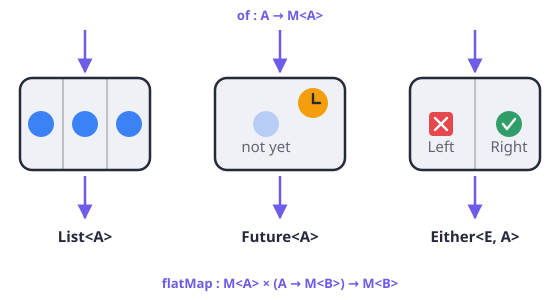
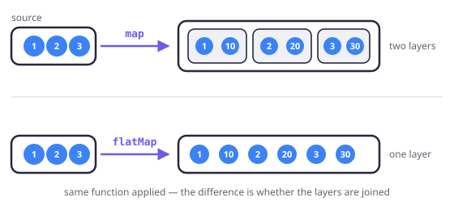
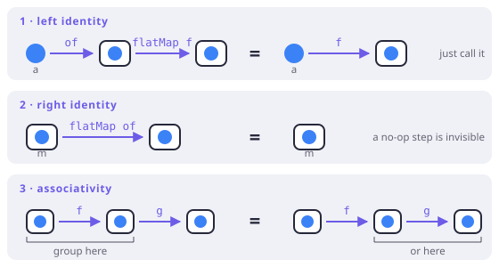

# What a monad actually is

> **In this chapter**
> - the three monads you already use in Dart, and what makes them one shape
> - the two operations — `of` and `flatMap` — and why flattening is the point
> - the three laws, as code you can run, and what breaks when a type ignores them
> - why Dart cannot declare a `Monad` interface, and what FxDart does instead

## Start from the code, not the definition

The famous definition — *a monad is a monoid in the category of
endofunctors* — is true, and it is the worst possible first sentence. It
describes the general case to someone who has not yet met a single instance.
So here are three instances first. You have written all three.

```dart run
import 'package:fxdart/fxdart.dart';

Either<String, int> parsePort(String text) => either((r) {
  final n = r.ensureNotNull(
      int.tryParse(text), () => 'not a number: $text');
  r.ensure(n > 1023, () => 'privileged port: $n');
  return n;
});

Future<int> fetchTimeout(int port) async => port + 100;

void main() async {
  // List<A>: many values in one structure.
  print([1, 2, 3].expand((x) => [x, x * 10]).toList());

  // Either<String, int>: a value, or a failure instead of it.
  print(parsePort('8080'));
  print(parsePort('80'));

  // Future<A>: a value that is not here yet.
  print(await Future.value(8080).then(fetchTimeout));
}
```

Three unrelated types. `List` holds many values, `Either` holds one value or
one failure, `Future` holds a value that has not arrived. What they share is
not what they hold — it is what you can *do* with them.



*Figure 1-1. Different contents, identical wiring: every one of them can take a plain value in, and every one of them can chain a function that hands back another box of the same kind.*

Each of these types gives you two operations:

| | put a value in | chain a step that returns another box |
|---|---|---|
| `List<A>` | `[a]` | `expand` |
| `Future<A>` | `Future.value(a)` | `then` |
| `Either<E, A>` | `Either.right(a)` | `flatMap` |
| `Fx<A>` (FxDart) | `fx([a])` | `flatMap` |

A type with those two operations, obeying three laws we will get to, is a
**monad**. That is the whole definition. The word is intimidating because it
arrived from category theory with its vocabulary attached, not because the
idea underneath is large.

## The two operations, precisely

Write `M<A>` for a value of type `A` inside a structure `M`. A monad is a
type constructor `M` plus:

- **of** (also called `pure`, `return`, or `unit`): `A → M<A>`. Take an
  ordinary value, get the most boring possible box containing it. Boring is
  a technical requirement: `Either.right(3)` adds no failure,
  `Future.value(3)` adds no waiting, `[3]` adds no extra elements.
- **flatMap** (also called `bind` or `>>=`):
  `M<A> × (A → M<B>) → M<B>`. Take a box, and a function that turns the
  value inside into *another box*, and get one box back — not a box of
  boxes.

The second half of that last sentence is the entire point, and it is easiest
to see by removing it. `map` alone is not enough:

```dart run
void main() {
  // The step returns a List, so map gives a List of Lists.
  final nested = [1, 2, 3].map((x) => [x, x * 10]).toList();
  print(nested);
  print(nested.runtimeType);

  // flatMap (Dart spells it `expand`) joins the inner lists
  // into the outer one.
  final flat = [1, 2, 3].expand((x) => [x, x * 10]).toList();
  print(flat);
  print(flat.runtimeType);
}
```



*Figure 1-2. Both operations apply the same function. `map` keeps the box the function returned, wrapping it in the box it started from; `flatMap` joins the two layers into one.*

Why does that matter so much? Because *a step that can fail, or wait, or
produce many answers, is exactly a function of type* `A → M<B>`. Real
programs are sequences of those steps. With only `map`, each step adds a
layer: three steps in a row give you `Either<E, Either<E, Either<E, A>>>`,
and nothing can be done with that value without unwrapping it three times.
`flatMap` keeps the depth at one, forever, no matter how many steps you
chain. Monads are how you compose functions that return contexts.

> **Terminology.** A type with only `map` (obeying its own two laws) is a
> **functor** — Chapter 5. Every monad is a functor: you can define
> `map(f)` as `flatMap((a) => of(f(a)))`. The reverse is not true, which is
> why the tower has more than one floor.

## You have been writing flatMap in disguise

Dart hides `flatMap` behind syntax you use daily. `await` *is* `flatMap` for
`Future`: it takes the value out of a future, runs the rest of the function
on it, and the result is one future — never a `Future<Future<T>>`. A
`for`-in loop that appends to a list is `flatMap` for `List`. Chapter 14's
`either { }` block is `flatMap` for `Either`.

Watch the same computation written both ways — first as an explicit chain,
then in FxDart's `either` scope:

```dart run
import 'package:fxdart/fxdart.dart';

Either<String, int> parseAge(String text) => either((r) {
  final n = r.ensureNotNull(
      int.tryParse(text), () => 'not a number: $text');
  r.ensure(n >= 0, () => 'negative age: $n');
  return n;
});

Either<String, String> lookup(String id) => id == 'u1'
    ? Either.right('Ada')
    : Either.left('no such user: $id');

// Explicit chaining: every dependent step nests
// one level deeper.
Either<String, String> greetChained(String id, String ageText) =>
    lookup(id).flatMap((name) =>
        parseAge(ageText).flatMap((age) =>
            Either.right('$name is $age')));

// The same steps in a Raise scope: straight-line code,
// with the same short-circuiting.
Either<String, String> greetScoped(String id, String ageText) =>
    either((r) {
  final name = r.bind(lookup(id));
  final age = r.bind(parseAge(ageText));
  return '$name is $age';
});

void main() {
  print(greetChained('u1', '36'));
  print(greetScoped('u1', '36'));
  print(greetScoped('u9', '36'));
  print(greetScoped('u1', 'old'));
}
```

Both versions do the same thing, including stopping at the first failure and
never running the second step when the first one fails. The difference is
that the chained version slides one indentation level to the right per step —
the shape every language with monads eventually invents syntax to hide.
Haskell calls its version `do`-notation, Scala calls it a
`for`-comprehension, Dart calls the special case of it `async`/`await`. FxDart's
`either` block is the same idea reached by a different mechanism, which is
[the subject of Chapter 15](#ch15).

## The three laws

The two operations are not enough. A type could define `of` and `flatMap`
and still behave surprisingly — so a monad must also obey three laws. They
read as pedantic statements of the obvious, which is exactly what makes them
valuable: they are the guarantees you already assume when you refactor.

1. **Left identity.** `of(a).flatMap(f)` = `f(a)`. Boxing a value and
   immediately chaining a step is the same as just calling the step.
2. **Right identity.** `m.flatMap(of)` = `m`. Unwrapping a box and putting
   the value straight back changes nothing.
3. **Associativity.** `m.flatMap(f).flatMap(g)` =
   `m.flatMap((a) => f(a).flatMap(g))`. How you group a chain of steps does
   not affect the result.



*Figure 1-3. Every law says the same kind of thing: two different routes through the diagram must arrive at the same value. The laws are what let you take either route.*

Here they are as assertions you can run against FxDart's `Either`:

```dart run
import 'package:fxdart/fxdart.dart';

Either<String, int> half(int n) =>
    n.isEven ? Either.right(n ~/ 2) : Either.left('odd: $n');

Either<String, int> minusOne(int n) => Either.right(n - 1);

void main() {
  final m = Either<String, int>.right(20);

  print(
      Either<String, int>.right(20).flatMap(half) == half(20));
  print(m.flatMap((a) => Either<String, int>.right(a)) == m);
  print(m.flatMap(half).flatMap(minusOne) ==
      m.flatMap((a) => half(a).flatMap(minusOne)));

  // The laws hold on the failure side too — that is what makes
  // short-circuiting composable rather than a special case.
  final bad = Either<String, int>.left('boom');
  print(bad.flatMap(half).flatMap(minusOne) ==
      bad.flatMap((a) => half(a).flatMap(minusOne)));
}
```

### What a broken law costs

Laws are not decoration. Break one and ordinary refactoring silently changes
behaviour. Here is a box that counts the steps taken — a plausible design,
and unlawful:

```dart run
class Logged<A> {
  const Logged(this.value, this.steps);
  final A value;
  final int steps;

  static Logged<A> of<A>(A value) => Logged(value, 0);

  // The `+ 1` is the bug: chaining charges for
  // the chaining itself.
  Logged<B> flatMap<B>(Logged<B> Function(A) f) {
    final next = f(value);
    return Logged(next.value, steps + next.steps + 1);
  }

  @override
  String toString() => 'Logged($value, steps: $steps)';
}

Logged<int> double_(int n) => Logged(n * 2, 1);

void main() {
  // Left identity: of(a).flatMap(f) should equal f(a).
  // It does not.
  print(Logged.of(21).flatMap(double_));
  print(double_(21));

  // Right identity: chaining a step that does nothing
  // should be invisible.
  final m = double_(21);
  print(m);
  print(m.flatMap(Logged.of));
}
```

Associativity happens to survive here — regroup the chain and the count is
unchanged — but both identity laws fail, and that is already fatal. Extracting
a trivial step into its own `flatMap`, or inlining one away, is a refactor
every reviewer would wave through, and in this type it changes the answer.

The fix is not to add a special case; it is to make `steps` a **monoid** —
a type with an associative combine and an identity element (Chapter 8) —
and let `of` produce the identity. Drop the `+ 1` and `Logged` becomes the
Writer monad, lawful and useful. That is the pattern behind most law
violations: an operation that looks harmless but has no identity element.

> 🎓 **The formal definition, for the record.** In category theory a monad on
> a category **C** is an endofunctor `T : C → C` with two natural
> transformations, `η : Id ⇒ T` (that is `of`) and `μ : T² ⇒ T` (that is
> `flatten`, from which `flatMap(f) = μ ∘ T(f)`), satisfying the unit and
> associativity coherence conditions — the three laws above, drawn as
> commuting diagrams. "A monoid in the category of endofunctors" says the
> same thing again: `μ` is the multiplication, `η` the unit. Nothing in this
> paragraph will help you write Dart, which is why it is in a box, and why
> Chapter 20 is where it belongs.

## What FxDart actually implements

Now the honest part. Dart cannot express the interface this chapter just
described. Writing it down requires a type parameter that is itself generic —
a higher-kinded type — and Dart has none:

```dart
// Does not compile. `M` is a type, and a type cannot take
// arguments here.
abstract class Monad<M> {
  M<A> of<A>(A value);
  M<B> flatMap<A, B>(M<A> box, M<B> Function(A) f);
}
```

Kotlin's Arrow, the library FxDart's typed errors are ported from, works
around this with compiler plugins and context receivers. Scala has the kind
system natively. Dart has neither, and no amount of cleverness recovers it —
attempts end in `dynamic` casts that give up exactly the type safety the
abstraction existed to provide.

So FxDart does the only honest thing: it implements the *shape*, per type,
and never pretends to abstract over it.

- **`Either<L, R>`** has `flatMap`, and `Either.right` is its `of`. The laws
  hold; you ran the check two pages ago.
- **`either((r) { … })`** is the ergonomic replacement for `do`-notation. It
  is not desugaring — `r.bind` short-circuits by raising into a scope
  (Chapter 15), a delimited-continuation trick rather than a monadic
  rewrite. Same straight-line code, different mechanism, and a distinction
  that matters when you ask why there is no `Raise` monad instance.
- **`Fx<A>`** is a lazy `Iterable` chain, and `Iterable` is the list monad:
  `flatMap` is its bind, `fx([a])` its `of`. Laziness does not disturb the
  laws — Chapter 11 shows why evaluation order is invisible to them.
- **`FxAsyncIterable<A>`** is the same shape over asynchronous sources, with
  the extra property that `concurrent(n)` changes *when* elements are
  computed without changing *which* — an equational-reasoning claim the laws
  underwrite.

What you lose by having no `Monad` interface is generic code that works for
every monad at once: one `traverse`, one `sequence`, one set of combinators
reused across `Either`, `Fx`, and `Future`. FxDart writes the concrete
versions instead. That is more code in the library and less abstraction in
your program — a trade the language chose, not the library.

## When the vocabulary earns its keep

You do not need the word "monad" to use `await`. The word starts paying when
you notice the *same* problem in three places — nested callbacks, a pyramid
of null checks, a chain of `Either`s — and realise it is one problem with one
solution shape. It pays again when a library gives you a type with `flatMap`
and you can predict, without reading the source, what chaining it will do.

And it pays when you are choosing between designs: if your type has `of` and
`flatMap` and the laws hold, users can refactor chains freely. If it has them
and the laws do not hold, you have built a trap. Chapter 5 climbs down one
floor to the functor and Chapter 6 to the applicative, where a great deal of
practical validation code lives.

## Exercises

1. `Set<A>` has `expand` and `{a}`. Check the three laws with a step whose
   results collide — for example `(x) => {x % 3}` over `{1, 2, 3, 4}`. Is
   `Set` a monad? What does your answer depend on?
2. Write `map` for `Either` using only `flatMap` and `Either.right`, then
   confirm it agrees with the built-in `map` on both a `Right` and a `Left`.
3. `Future` has `then`. Is `Future.value(a).then(f)` really equal to `f(a)` —
   equal as *values*, or only in what they eventually produce? What does
   that tell you about which equality the laws are stated over?
4. Fix `Logged` so all three laws hold, then chain two steps in both
   groupings and show the counts agree.

## Solutions

1. **Yes, with a caveat about equality.** All three laws hold when equality
   is set equality, because `Set` throws away order and duplicates on both
   sides of every law equally. `{1,2,3,4}.expand((x) => {x % 3})` gives
   `{1, 2, 0}` either way you group it. The caveat is the point: a law is
   stated *over an equality*, and a type can be lawful under one notion of
   equality and unlawful under another — `List` under set equality is
   lawful; `Set` under "same insertion order" is not.
2. `Either<L, B> mapViaFlatMap<L, A, B>(Either<L, A> e, B Function(A) f) =>
   e.flatMap((a) => Either.right(f(a)));`. On a `Left` neither version calls
   `f`, which is left identity's fingerprint on the failure side.
3. They are not the same object, and `==` on futures compares identity, so
   the law is stated over *observational* equality: the two programs produce
   the same value and the same effects. This is the equality every monad law
   is really about; the `Either` checks earlier in the chapter only got to
   use `==` because `Either` defines structural equality.
4. Remove `+ 1` from `flatMap` and let `double_` report its own cost:
   `Logged(next.value, steps + next.steps)`. Now `of` contributes the
   identity element of `+`, chaining contributes nothing of its own, and all
   three laws hold — `Logged.of(1).flatMap(f).flatMap(g)` and
   `Logged.of(1).flatMap((x) => f(x).flatMap(g))` both report 2.
