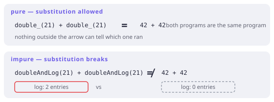

# Purity and effects

> **In this chapter**
> - referential transparency as a mechanical test you can apply to any expression
> - the four capabilities purity buys — memoising, reordering, parallelising, testing
> - where effects hide in ordinary Dart, including the ones that do not look like effects
> - the seam: a pure core with effects pushed to the edge, and what FxDart gives you at that seam

## The substitution test

A function is **pure** when a call to it can be replaced by its result
everywhere, without changing what the program does. That property has a name —
**referential transparency** — and it is a mechanical test, not a style
preference.

```dart run
int double_(int n) => n * 2;

var log = <String>[];
int doubleAndLog(int n) {
  log.add('doubled $n');
  return n * 2;
}

void main() {
  // Substitution holds: double_(21) and 42 are the same thing.
  print([double_(21), double_(21)]);
  print([42, 42]);

  // Substitution fails: the two programs differ in `log`.
  print([doubleAndLog(21), doubleAndLog(21)]);
  print(log);
}
```

Both functions return the same number. Only one of them lets you rewrite the
program around it. That difference — not the presence of the word `void`, not
whether a linter complains — is what "pure" means.



*Figure 2-1. Purity is the permission to redraw the left picture as the right one. Every refactoring you perform by hand is an appeal to this permission.*

## What purity buys

Four capabilities, and you already rely on all of them:

| Capability | Why purity is required |
|---|---|
| **Memoise** | Caching a result assumes the second call would have done the same thing |
| **Reorder** | Moving a line assumes nothing else observes when it ran |
| **Parallelise** | Running two calls at once assumes neither can see the other |
| **Test** | Asserting on a return value assumes the value is the whole story |

FxDart's `memoize` is the sharpest example: it is *correct* for a pure function
and a silent bug for an impure one.

```dart run
import 'package:fxdart/fxdart.dart';

int calls = 0;
int slowSquare(int n) {
  calls++;
  return n * n;
}

void main() {
  final fast = memoize(slowSquare);
  print([fast(9), fast(9), fast(9)]);
  print('underlying calls: $calls');
}
```

Three calls, one evaluation. Nothing in `memoize` checks that `slowSquare` is
pure — it *assumes* it. That is the shape of most functional machinery: the
library provides the mechanism, the law provides the licence, and you are the
one who has to keep the bargain.

## Where effects hide in Dart

An **effect** is anything a caller can observe besides the returned value, or
anything the result depends on besides the arguments. Dart hides several in
plain sight:

- **Mutation of shared state** — the obvious one, including a captured `List`.
- **Reading the clock or the platform** — `DateTime.now()`, `Platform.isIOS`.
  Same arguments, different answers.
- **Randomness** — which is why FxDart ships `createSeededRandom`: a seed turns
  an effect back into an argument.
- **Throwing** — an exception is a second, invisible return channel. Part IV
  is about giving it a visible one.
- **`print` and IO** — output is observable by definition.
- **Identity** — `List` equality is by reference, so returning a fresh list is
  observably different from returning a shared one under `identical`.

```dart run
import 'package:fxdart/fxdart.dart';

void main() {
  // A seed makes randomness reproducible: same input, same
  // output, so a shuffle becomes testable.
  final a = shuffle([1, 2, 3, 4, 5], 7);
  final b = shuffle([1, 2, 3, 4, 5], 7);
  print(a);
  print('reproducible: ${a.toString() == b.toString()}');
}
```

> 🎓 **"Pure" is about the language's observation, not the universe.** A pure
> function still burns CPU, allocates, and heats the room. Purity is defined
> relative to what the *program* can observe: two expressions are
> interchangeable if no Dart code can tell them apart. Time and memory are
> outside that lens — which is exactly why Chapter 14 has to measure them
> separately, and why "pure" never means "free".

## The seam

Nobody ships a program with no effects; the goal is to know *where* they are.
The standard arrangement is a **pure core with an effectful shell**: parse,
decide, and compute in pure functions; read and write at the edges.

Pipelines make the seam visible, because a lazy pipeline is a *description* of
work rather than the work itself. Compare where the effect sits:

```dart run
import 'package:fxdart/fxdart.dart';

class Order {
  const Order(this.id, this.total, this.status);
  final String id;
  final int total;
  final String status;
}

const orders = [
  Order('a', 120, 'paid'),
  Order('b', 40, 'refunded'),
  Order('c', 260, 'paid'),
];

// Pure core: data in, data out. No printing, no clock, no IO.
List<String> receipts(Iterable<Order> all) => fx(all)
    .filter((o) => o.status == 'paid')
    .sortByDesc((o) => o.total)
    .map((o) => '${o.id}: ${o.total}')
    .toList();

void main() {
  // Effectful shell: the one place that touches the world.
  receipts(orders).forEach(print);
}
```

`receipts` is testable by equality alone, and `peek` gives you a declared seam
for the times you need to observe a pipeline without breaking that property —
it is a *labelled* effect rather than a hidden one:

```dart run
import 'package:fxdart/fxdart.dart';

void main() {
  final seen = <int>[];
  final result = fx(range(1, 6))
      // the effect is named, and it is the only one
      .peek(seen.add)
      .filter((n) => n.isEven)
      .toList();
  print(result);
  print(seen);
}
```

## When this earns its keep

Purity is not a virtue you accumulate; it is leverage you spend. It pays when
you need to cache, retry, reorder, run concurrently, or write a test that does
not need a fixture — which is to say, in exactly the situations Parts III and
IV are about. `concurrent(n)` (Chapter 13) is only safe because the callbacks
it runs out of order cannot see each other.

It costs when the effect *is* the point. A logger, a migration script, a UI
event handler: wrapping those in ceremony buys nothing. Chapter 22 makes that
case at length.

## Exercises

1. Is `List.of(items)` pure? Consider both `==` and `identical` as the way a
   caller might observe the result.
2. Write a function that is pure in Dart's eyes but depends on a mutable field
   that never changes after construction. Is it referentially transparent? What
   would break the moment someone made the field non-final?
3. `memoize` on a function of type `int Function(int)` is safe. What goes wrong
   if the argument type is a mutable `List<int>`?
4. Take the `receipts` pipeline above and add a requirement: log every order
   that was filtered out. Do it without making `receipts` impure.

## Solutions

1. **Pure by `==`, impure by `identical`.** Two calls with the same argument
   return equal lists but never the same object, so a program that compares
   with `identical` can tell the calls apart. This is why "pure" is always
   stated relative to an observation — the same subtlety appears in Chapter 1's
   exercise about `Future` equality.
2. Something like `class Rate { const Rate(this.pct); final int pct;
   int apply(int n) => n * pct ~/ 100; }`. It is referentially transparent
   because `pct` cannot change; the instance is part of the input, just spelled
   as a receiver rather than an argument. Drop `final` and the same call can
   return two answers, so substitution fails.
3. `memoize` keys on the argument, and a mutable list's contents can change
   after it is used as a key — a caller mutates the list, calls again, and gets
   the answer for the *old* contents. The cache is not wrong; the assumption
   was.
4. Return the rejected orders instead of logging them — `fork` or a
   `partition`-style split makes the function total in what it reports, and the
   caller (the shell) decides what to print. If you only need to observe, use
   `.peek(rejected.add)` on the rejected branch: still a declared effect at a
   named seam, still no IO inside the core.
