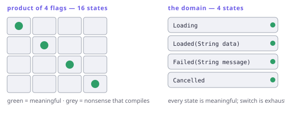

# Making illegal states unrepresentable

> **In this chapter**
> - products and sums: the two ways types combine, and how to count their values
> - why `sealed` + `switch` is the feature that makes sum types worth using
> - the refactor: replace a bag of nullable fields with a type that cannot lie
> - where records fit, and where a type is the wrong tool

## Counting the states

A type is a set of values, and you can count it. `bool` has 2. `Null` has 1.
An enum with three constants has 3. Once you can count, the two ways of
combining types get their names:

- A **product** holds one of each: a record `(bool, bool)` has 2 × 2 = 4
  values. Fields of a class are a product.
- A **sum** holds one of several: `bool | Null` has 2 + 1 = 3 values. In Dart,
  a `sealed` hierarchy is a sum, and so — informally — is `T?`.

Design bugs are almost always the same bug: **the type has more values than the
domain does.** Here is the classic form.

```dart run
// Four fields; 2 × 2 × 2 × 2 = 16 representable combinations…
class Request {
  Request(
      {this.loading = false,
      this.data,
      this.error,
      this.cancelled = false});
  final bool loading;
  final String? data;
  final String? error;
  final bool cancelled;
}

void main() {
  // …but this one is nonsense, and it compiles.
  final broken =
      Request(loading: true, data: 'ok', error: 'boom');
  print([broken.loading, broken.data, broken.error]);
}
```

Four states are meaningful — loading, loaded, failed, cancelled — and the type
admits sixteen. The twelve extra ones are where the bugs live, and every
`if (r.error != null && !r.loading)` in the codebase is a hand-written patch
over one of them.



*Figure 3-1. The type on the left is a product of four flags; the domain is a sum of four cases. Every cell outside the diagonal is a state your code must either handle or hope never happens.*

## The sum type, and the feature that makes it pay

```dart run
sealed class Request {
  const Request();
}

class Loading extends Request {
  const Loading();
}

class Loaded extends Request {
  const Loaded(this.data);
  final String data;
}

class Failed extends Request {
  const Failed(this.message);
  final String message;
}

class Cancelled extends Request {
  const Cancelled();
}

String render(Request r) => switch (r) {
  Loading() => 'spinner',
  Loaded(:final data) => 'showing $data',
  Failed(:final message) => 'error: $message',
  Cancelled() => 'cancelled',
};

void main() {
  const all = [
    Loading(),
    Loaded('42 rows'),
    Failed('timeout'),
    Cancelled()
  ];
  all.map(render).forEach(print);
}
```

Four cases, exactly four states, no nullable fields, and no `default` arm. That
last detail is the whole point: `sealed` makes the `switch`
**exhaustive**, so adding a fifth case turns every place that handles the type
into a compile error listing precisely what you have not thought about yet. A
sum type without exhaustiveness checking is just a class hierarchy with extra
steps; Dart 3 supplied the missing half.

This is the same machinery `Either` uses — it is a sealed sum of `Left` and
`Right` (Chapter 16), which is why `switch` over an `Either` needs no fallback
arm either.

## Products: records, and where they stop

Records give you an anonymous product where a class would be ceremony:

```dart run
import 'package:fxdart/fxdart.dart';

void main() {
  // `attach` pairs each value with something derived from it:
  // a product, produced lazily, with no class to declare.
  final priced = fx(['apple', 'fig', 'banana'])
      .attach((name) => name.length)
      .toList();
  print(priced);

  final total = fx(priced).sumBy((row) => row.$2);
  print('total letters: $total');
}
```

A record is the right tool when the pairing is *local* — an intermediate step
in a pipeline, a two-value return. It is the wrong tool once the pairing has a
name in the domain and rules attached to it, because a record cannot carry an
invariant. `(String, int)` cannot promise the `int` is non-negative;
`class Money { Money(this.cents) : assert(cents >= 0); }` can.

> 🎓 **Why "algebraic" data types.** Products multiply their sizes and sums add
> them, and the algebra keeps going: `Either<A, B>` has |A| + |B| values,
> `A?` has |A| + 1, and functions `A → B` have |B|^|A| — which is why the
> arrow is written as exponentiation in the literature. The isomorphism
> `(A, B) → C ≅ A → (B → C)` — currying, Chapter 4 — is the type-level
> statement that `(c^b)^a = c^(b×a)`. The names are not decoration; the
> arithmetic is real, and it predicts which refactorings preserve meaning.

## The refactor, in three moves

1. **Count.** Write down how many states the type admits, and how many the
   domain has. If they differ, the gap is your bug budget.
2. **Name the real cases.** One `sealed` subclass each, each carrying exactly
   the data that case needs — `Loaded` has `data` and no `message`, and no
   nullable anything.
3. **Delete the guards.** Every `if (x != null && !y)` that existed to rule out
   an impossible combination goes away, replaced by a `switch` arm the compiler
   watches.

The payoff is not elegance, it is that the *next* change is checked. Adding
`Retrying` to `Request` produces a list of compile errors, which is a to-do
list written by the compiler and impossible to forget.

## When this earns its keep

Use it where a wrong combination would be a real defect and where cases will
grow: request/response states, parse results, protocol messages, anything with
"or" in its specification.

Skip it for genuinely open-ended data, for a struct that is just three
independent numbers, and — importantly — at the boundary with JSON, where the
world hands you a bag of nullables regardless. There, the sum type is what you
parse *into*: one place converts the shapeless map into a value that cannot
lie, and everything downstream gets the guarantee. That parse is the subject of
Part IV.

## Exercises

1. How many values does `(bool, String?)` have if `String` has *n* values?
   And `Either<bool, bool>`?
2. Model a traffic light that is either red, amber, green, or "flashing amber
   with a reason". Which cases carry data, and how many states does your type
   admit?
3. Take the `Request` class at the top of the chapter and write down the twelve
   nonsense states. Which of them would your codebase currently crash on, and
   which would silently render something wrong?
4. `Either<String, int>` and `(String?, int?)` can both represent "a failure or
   a number". Give a concrete reason to prefer the first.

## Solutions

1. `(bool, String?)` is a product of 2 and (*n* + 1), so 2*n* + 2 values.
   `Either<bool, bool>` is a sum: 2 + 2 = 4 — the same count as
   `(bool, bool)`, but they are different types, and confusing the two is
   precisely the modelling error this chapter is about.
2. Three constant cases plus one that carries a `String reason`:
   `sealed class Light` with `Red`, `Amber`, `Green`, `FlashingAmber(reason)`.
   The type admits 3 + *r* states, where *r* is the number of reason strings —
   which is honest, because a flashing amber genuinely does carry more
   information than a red.
3. All sixteen minus the four real ones: `loading` with `data`, `loading` with
   `error`, `data` with `error`, `cancelled` with anything else, and the empty
   state where all four are null/false. The empty one is usually the crash
   (nothing to render); the combinations are usually the silent bug, because
   the first `if` in the render function wins and the rest of the state is
   discarded unread.
4. `Either` is a sum, so the compiler can prove exactly one side is present and
   `switch` covers both without a fallback. `(String?, int?)` is a product of
   two optionals: four states, two of which — both null, both non-null — are
   nonsense you must handle by hand at every use site.
