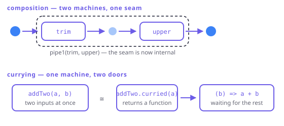

# Functions as values

> **In this chapter**
> - composition as the operation that turns two functions into one
> - partial application and currying, and the difference between them
> - why a faithful curried `pipe` cannot be typed in Dart
> - what FxDart ships instead, and the price of that choice

## Composition

Two functions line up when one's output is the other's input, and composing
them produces a third function that mentions no intermediate value:

```dart run
import 'package:fxdart/fxdart.dart';

String trim(String s) => s.trim();
String upper(String s) => s.toUpperCase();

// Dart has no composition operator, so composition is a
// three-line helper. Its shortness is the point: the concept
// is small, only the notation is missing.
C Function(A) compose2<A, B, C>(
        B Function(A) f, C Function(B) g) =>
    (a) => g(f(a));

void main() {
  // By hand.
  String shout(String s) => upper(trim(s));
  print(shout('  hello  '));

  // As a value: the composition is itself passable.
  final shout2 = compose2(trim, upper);
  print(shout2('  hello  '));
  print(['  a ', ' b'].map(shout2).toList());

  // pipe1 is the same idea with the value supplied first.
  print(pipe1('  hi ', shout2));
}
```

Composition is associative — `(f ∘ g) ∘ h` equals `f ∘ (g ∘ h)` — and the
identity function is its unit. That is a monoid (Chapter 8), and it is the
reason you can group a pipeline's stages any way you like without changing the
result. It is also the reason "extract a helper" is always safe: pulling three
chained steps into a named function is exactly the regrouping the law permits.

## Partial application vs currying

They get used interchangeably and they are not the same thing.

- **Partial application** fixes *some* arguments now and takes the rest later:
  `add(2, _)` becomes a one-argument function.
- **Currying** rewrites an *n*-argument function as *n* nested one-argument
  functions: `int Function(int, int)` becomes
  `int Function(int) Function(int)`. Partial application is then just calling
  the first layer.

```dart run
import 'package:fxdart/fxdart.dart';

int addTwo(int a, int b) => a + b;

void main() {
  // Currying: one call per argument.
  final curriedAdd = addTwo.curried;
  final add10 = curriedAdd(10);
  print([add10(5), add10(32)]);

  // Partial application without currying: a closure does it too.
  int Function(int) addAlso(int a) => (b) => a + b;
  print(addAlso(10)(32));

  // Uncurrying goes back.
  print(curriedAdd.uncurried(40, 2));
}
```



*Figure 4-1. Composition joins two machines end to end and hides the join. Currying re-slots one machine with two inputs as two machines with one input each.*

## Why FxTS's `pipe` could not be ported

FxTS is built on a curried `pipe`: every operator is a function that takes its
callback and returns a function awaiting the data, and `pipe` threads a value
through a list of them. TypeScript types that with ~20 hand-written overloads,
one per arity, and variadic tuple types to relate them.

Dart has neither overloads nor variadic generics. A `pipe` that accepts any
number of stages has to fall back on `dynamic`:

```dart
// FxDart ships this for FxTS parity — and every stage boundary
// is an unchecked cast.
final result = pipe(
  [1, 2, 3, 4],
  (dynamic xs) =>
      map((dynamic n) => (n as int) * 2, xs as Iterable),
  (dynamic xs) => toList(xs as Iterable<int>),
);
```

Every stage boundary is an unchecked cast. The type error you wanted the
compiler to catch — a `String` stage in an `int` pipeline — now arrives at
runtime, in the middle of a lazy iterator, with a stack trace that points at
library internals.

So FxDart chose a different shape for the same idea:

```dart run
import 'package:fxdart/fxdart.dart';

void main() {
  final result = fx([1, 2, 3, 4, 5, 6])
      .map((n) => n * 2)
      .filter((n) => n > 4)
      .take(3)
      .toList();
  print(result);
}
```

The chain is a *typed* composition: each method returns `Fx<R>` with the new
element type, so the compiler follows the value all the way down, and your
editor can complete it. What it gives up is the ability to hold a stage as a
first-class value and pass it around — in FxTS, `map(f)` alone is a value; in
FxDart it is a method call that needs a receiver. `WHY_CURRIED.md` in the
repository records that trade in full.

> 🎓 **Currying is an isomorphism, not a convention.** `(A, B) → C` and
> `A → (B → C)` carry exactly the same information — you can convert either way
> without loss, which is what `.curried` / `.uncurried` demonstrate at runtime.
> Languages that curry by default (Haskell, OCaml) picked one side of the
> isomorphism as primitive; Dart picked the other. Nothing is expressible in
> one that is not expressible in the other — only the ergonomics differ, and
> ergonomics is exactly why the choice matters.

## Higher-order functions you already use

A function that takes or returns a function is **higher-order**, and the
pipeline vocabulary is nothing but higher-order functions: `map`, `filter`,
`fold`, `sortBy` all take behaviour as an argument. Two more from FxDart worth
knowing by name:

```dart run
import 'package:fxdart/fxdart.dart';

bool small(int n) => n < 10;
bool odd(int n) => n.isOdd;

void main() {
  // juxt: one input, several functions, all their results.
  final stats = juxt([
    (Iterable<int> xs) => xs.length,
    (Iterable<int> xs) => xs.reduce((a, b) => a + b),
  ]);
  print(stats([3, 1, 4, 1, 5]));

  // Predicates are values too, so they combine.
  final both = (int n) => small(n) && odd(n);
  print(fx([3, 12, 7, 20]).filter(both).toList());
  print(fx([3, 12, 7, 20]).filter(negate(small)).toList());
}
```

## When this earns its keep

Treating functions as values pays when behaviour varies but structure does
not — one pipeline, four policies passed in; one validator, composed from
small named rules. It also pays at test time: a function parameter is the
cheapest seam there is, and needs no mocking framework.

It stops paying when the composition gets longer than the thing it replaced. A
chain of six point-free combinators that a reader must mentally apply to a
value is worse than a `for` loop with a good name. Dart's lack of a composition
operator makes this threshold arrive sooner than in Haskell, and pretending
otherwise is how FP code earns its reputation.

## Exercises

1. `compose2(f, g)` applies `f` first. Haskell's `.` operator applies the
   *right-hand* function first. Which order does `fx(...).map(f).map(g)` use,
   and why is that the only sane choice for a method chain?
2. Write `compose3` for three one-argument functions using `compose2` twice.
   Then argue that the two ways of grouping the calls give the same function.
3. `addTwo.curried(10)` returns a function. What is its type, spelled out in
   full? Why can Dart not infer a `curried` getter for a function of arbitrary
   arity?
4. Rewrite `fx(xs).filter(small).filter(odd)` as a single `filter`. Is that
   always a safe refactor? What property of `filter` does it rely on?

## Solutions

1. The chain applies left to right: `map(f)` then `map(g)`, matching reading
   order. A method chain has to — the receiver is on the left, so the first
   thing written is the first thing applied. Haskell's `.` reads right to left
   because it mirrors mathematical `f ∘ g`; both are consistent, and mixing
   them in one codebase is the actual hazard.
2. `D Function(A) compose3<A, B, C, D>(...)` built as
   `compose2(compose2(f, g), h)` or `compose2(f, compose2(g, h))`. Same
   function because composition is associative — the same law that lets you
   regroup pipeline stages, and the same shape as monad associativity in
   Chapter 1.
3. `int Function(int)`. Dart cannot express "a function of any arity" as a type
   parameter, so `curried` is written out once per arity — `Curry2` through
   `Curry5` extensions on `R Function(A, B)`, `R Function(A, B, C)`, and so on.
   It is the same wall as the missing variadic generics in `pipe`, and the same
   wall as higher-kinded types in Chapter 10: Dart's type system is
   deliberately first-order.
4. `fx(xs).filter((n) => small(n) && odd(n))`. It is safe when the predicates
   are pure — the fused version calls `small` and `odd` on the same element in
   the same order, and short-circuits identically. If a predicate has a side
   effect (counting how many elements it saw, say), the two versions differ:
   the chained form runs `odd` only on survivors, and so does the fused one, but
   an effect ordered *between* the two filters would move. Purity is what makes
   fusion a refactor rather than a rewrite.
