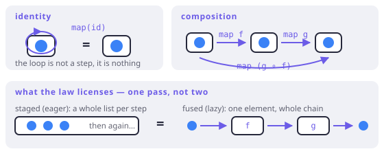

# Functor

> **In this chapter**
> - the functor: one operation, `map`, with two laws
> - what the laws forbid, shown with a type that breaks them
> - why the composition law is what licenses stage fusion in a pipeline
> - functors that are not containers, including the one hiding in `Function`

## One operation

A **functor** is a type `F` with a single operation:

`map : F<A> × (A → B) → F<B>`

Take a structure holding `A`s and a plain function `A → B`, get the same
structure holding `B`s. "Same structure" is doing the real work in that
sentence, and the two laws are what pin it down.

Dart is full of functors and calls them different things:

```dart run
import 'package:fxdart/fxdart.dart';

void main() {
  print([1, 2, 3].map((n) => n * 2).toList()); // List
  print(Either<String, int>.right(20).map((n) => n * 2));
  print(Either<String, int>.left('nope').map((n) => n * 2));
  print(fx([1, 2, 3]).map((n) => n * 2).toList()); // Fx
}
```

Notice the third line. Mapping a `Left` does nothing, and that is not a special
case bolted on — it is forced. `map` may not change the structure, and for
`Either` the choice of side *is* the structure. A `map` that turned a `Left`
into a `Right` would be some other function wearing the name.

## The two laws

1. **Identity.** `m.map((x) => x) == m`. Mapping the identity function changes
   nothing at all — not the values, not the shape, not anything observable.
2. **Composition.** `m.map(f).map(g) == m.map((x) => g(f(x)))`. Two passes with
   two functions equal one pass with their composition.

```dart run
import 'package:fxdart/fxdart.dart';

int addOne(int n) => n + 1;
int triple(int n) => n * 3;

void main() {
  final m = Either<String, int>.right(7);

  // identity
  print(m.map((x) => x) == m);

  // composition
  print(m.map(addOne).map(triple) ==
      m.map((x) => triple(addOne(x))));

  // both hold on the other side too
  final bad = Either<String, int>.left('boom');
  print(bad.map((x) => x) == bad);
}
```



*Figure 5-1. Identity says the loop does nothing. Composition says the two routes across the square land on the same value — which is why a pipeline may be re-cut anywhere between stages.*

## What the laws forbid

They rule out a `map` that does anything *besides* apply the function. Here is
a plausible type that fails:

```dart run
// A box that remembers how many times it was mapped.
class Counted<A> {
  const Counted(this.value, this.maps);
  final A value;
  final int maps;

  Counted<B> map<B>(B Function(A) f) =>
      Counted(f(value), maps + 1);

  @override
  bool operator ==(Object other) =>
      other is Counted &&
      other.value == value &&
      other.maps == maps;

  @override
  int get hashCode => Object.hash(value, maps);

  @override
  String toString() => 'Counted($value, maps: $maps)';
}

void main() {
  final m = Counted(7, 0);

  // Identity fails: mapping "nothing" is observable.
  print(m.map((x) => x) == m);

  // Composition fails: two passes cost two, one pass costs one.
  print(m.map((x) => x + 1).map((x) => x * 3));
  print(m.map((x) => (x + 1) * 3));
}
```

The type is not *wrong* — counting maps might be exactly what you want. What it
is not is a functor, and the practical consequence is precise: a reader may no
longer fuse or split its `map` calls, because doing so changes the result. Laws
are permissions, and this type withholds one.

## The composition law is a performance feature

Read the composition law from right to left and it stops being philosophy:

`m.map(f).map(g)` — two traversals — is *equal to* `m.map(g ∘ f)`, one
traversal. A library may therefore rewrite the first into the second whenever
it likes, and you never find out.

That is not hypothetical in FxDart. Lazy pipelines fuse stages so that a value
flows through the whole chain once rather than being materialised between
steps, and the licence for that rewrite is the functor law:

```dart run
import 'package:fxdart/fxdart.dart';

void main() {
  final seen = <String>[];

  final result = fx([1, 2, 3])
      .map((n) => n + 1)
      .peek((n) => seen.add('after +1: $n'))
      .map((n) => n * 3)
      .peek((n) => seen.add('after *3: $n'))
      .toList();

  print(result);
  // Interleaved, not staged: element by element through the
  // whole chain — the one-pass reading of the composition law.
  seen.forEach(print);
}
```

Two `map`s and no intermediate list. In an eager language you would pay for one
list per stage; here the law says you do not have to, and the implementation
takes the law up on it. Chapter 11 makes this evaluation story explicit.

> 🎓 **Functor, formally.** A functor is a mapping between categories that
> sends objects to objects and arrows to arrows while preserving identity and
> composition — which is exactly the two laws, stated once for the general
> case. In programming we only ever use *endo*functors on the category of
> types: `F` maps the type `A` to the type `F<A>`, and `map` lifts an arrow
> `A → B` to an arrow `F<A> → F<B>`. Chapter 20 draws the diagram; nothing
> above depends on it.

## Functors that are not containers

"A functor holds values" is a useful lie. What a functor really has is a
*position* the function can act on, and some of those positions hold nothing at
all.

- `Future<A>` — the value is not here yet; `then` is its `map`.
- A parser or decoder — `map` changes what a *future* parse will produce.
- `Function(X) → A` — the reader functor. Mapping over a function composes onto
  its result:

```dart run
void main() {
  int Function(String) length = (s) => s.length;

  // map for functions IS composition: apply, then transform.
  int Function(String) doubledLength = (s) => length(s) * 2;

  print([length('functor'), doubledLength('functor')]);
}
```

That last one is worth sitting with: composition and `map` are the same
operation seen from two angles, which is why Chapter 4's associativity and this
chapter's composition law feel like the same sentence twice. They are.

## When this earns its keep

The word pays off as a *prediction tool*. Meet an unfamiliar type with a `map`
and you already know three things: it will not change the shape, mapping
identity is a no-op, and you may split or fuse the calls freely. That is a lot
of knowledge for one word.

It also tells you when a type is lying. A `map` whose documentation mentions
retries, ordering changes, or caching is not a functor's `map`, and you should
read the source before you refactor around it.

## Exercises

1. Prove — informally, by cases — that `Either.map` satisfies the identity law.
   How many cases are there, and why is that number the whole proof?
2. `Set` has a `map`. Does it satisfy the composition law when `f` maps two
   distinct elements to the same value? Try `{1, 2}` with `f = (x) => 0` and
   `g = (x) => x + 1`.
3. If a type has `map` obeying both laws, is `map` unique? That is, could there
   be two different lawful `map`s for the same type — and does the answer differ
   for `List` vs `Either`?
4. FxDart's `peek` returns the same element type. Is `peek` a `map`? What law
   does it break, and which chapter's vocabulary explains why nobody minds?

## Solutions

1. Two cases. `Left(e).map(id)` returns `Left(e)` by definition, and
   `Right(a).map(id)` returns `Right(id(a))` = `Right(a)`. `Either` is a sum
   with exactly two constructors, so covering both *is* covering every value —
   the same exhaustiveness that Chapter 3 got from `sealed`.
2. It does. `{1, 2}.map(f)` is `{0}` and mapping `g` gives `{1}`; the fused
   `g ∘ f` gives `{1}` too. Deduplication happens on the way out in both
   routes. What `Set` breaks is not composition but the intuition that a
   functor preserves *size* — nothing in the laws promises that.
3. For `List`, no: a `map` that also reversed the list satisfies identity
   (reversing twice? no — reversing once breaks identity, since
   `xs.map(id)` would be `xs.reversed`). The interesting answer is that the
   laws pin `map` down for any type whose shape is determined by its contents'
   positions, which covers `List` and `Either` both. In practice, for these
   types the lawful `map` is unique, and that uniqueness is why the name can be
   trusted.
4. `peek` is not a `map` — it is `map` with an effect attached, so it breaks
   the identity law the moment the callback does anything observable
   (`peek((_) {})` is a no-op, `peek(print)` is not). Chapter 2's vocabulary is
   the explanation: `peek` exists precisely to make an effect *declared*, and a
   declared effect is not a violation but a documented exception.
