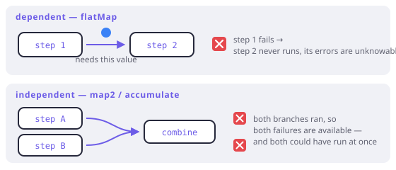

# Applicative

> **In this chapter**
> - the difference between *dependent* and *independent* steps, in types
> - the applicative: combining several structures without either seeing the other
> - why accumulating every error is impossible for a monad and natural here
> - FxDart's `map2`, `zipOrAccumulate`, and the `accumulate` scope

## Two shapes of "and then"

Chapter 1's `flatMap` composes steps where the second depends on the first: you
cannot look up the user's order until you have the user. That dependency is
written into the type — `A → M<B>` takes the value out of the first box.

But a great deal of real code has no such dependency. Validating a form: the
name check does not need the age, and the age check does not need the name.
They are *independent*, and the type of the operation that combines them says
so:

`map2 : F<A> × F<B> × ((A, B) → C) → F<C>`

No arrow from `A` into the second structure. Both are already there; the
function only combines the results. A type with `map2` (plus a way to lift a
plain value, exactly Chapter 1's `of`) is an **applicative functor**.



*Figure 6-1. `flatMap` cannot start the second step until the first produces a value. `map2` has both from the start — which is what makes running them concurrently, or reporting both failures, even a possibility.*

## Fail fast with `map2`

```dart run
import 'package:fxdart/fxdart.dart';

class User {
  const User(this.name, this.age);
  final String name;
  final int age;

  @override
  String toString() => 'User($name, $age)';
}

Either<String, String> vName(String s) =>
    s.isEmpty ? Either.left('name is empty') : Either.right(s);

Either<String, int> vAge(String s) {
  final n = int.tryParse(s);
  if (n == null) return Either.left('age is not a number');
  if (n < 0) return Either.left('age is negative');
  return Either.right(n);
}

void main() {
  print(vName('Ada').map2(vAge('36'), User.new));
  print(vName('').map2(vAge('36'), User.new));
  // Both wrong — but only the leftmost failure is reported.
  print(vName('').map2(vAge('nope'), User.new));
}
```

The last line is the problem this chapter exists to solve. The user filled in
two fields wrong; the form told them about one. Nothing about the *structure*
forced that — both `Either`s were computed. It is the reporting that is
fail-fast, and `map2` reports only the leftmost.

## Why a monad cannot accumulate

Try to write the accumulating version with `flatMap` alone and you hit a wall
that is not a limitation of effort:

```dart
name.flatMap((n) => age.flatMap((a) => Either.right(User(n, a))));
```

If `name` is a `Left`, the outer `flatMap` short-circuits — and the function
that would have looked at `age` *never runs*, because it is inside the
callback. `flatMap`'s type says the second step is a function of the first
value, so when there is no first value there is no second step. Short-circuit
is not a policy choice here; it is what the type means.

The applicative is strictly weaker, and the weakness is the feature. `map2`
holds both structures as *data* before combining them, so an implementation is
free to look at both and concatenate their failures.

## Accumulating, in FxDart

Dart has no `Validated` type; FxDart follows Arrow 2.x and provides an
accumulating *scope* instead. Inside `either`, ask for one:

```dart run
import 'package:fxdart/fxdart.dart';

class User {
  const User(this.name, this.age);
  final String name;
  final int age;

  @override
  String toString() => 'User($name, $age)';
}

Either<Nel<String>, User> parse(String name, String age) =>
    either((r) => r.zipOrAccumulate2(
          (br) {
            if (name.isEmpty) br.raise('name is empty');
            return name;
          },
          (br) {
            final n = int.tryParse(age);
            if (n == null) br.raise('age is not a number');
            if (n! < 0) br.raise('age is negative');
            return n;
          },
          User.new,
        ));

void main() {
  print(parse('Ada', '36'));
  print(parse('', '36'));
  print(parse('', 'nope')); // both failures, in branch order
}
```

Every branch runs; failures concatenate into a `NonEmptyList` (Chapter 8
explains why that type and not a plain `List`). For more than five branches, or
for rules that depend on earlier ones, drop to the full scope:

```dart run
import 'package:fxdart/fxdart.dart';

Either<Nel<String>, String> checkout(
  String item,
  String qty,
  String coupon,
) =>
    either((r) => r.accumulate((acc) {
          final i = acc.accumulating((br) {
            if (item.isEmpty) br.raise('item required');
            return item;
          });
          final q = acc.accumulating((br) {
            final n = int.tryParse(qty);
            if (n == null) br.raise('qty is not a number');
            return n ?? 0;
          });
          // Dependent rule: only meaningful once qty parsed.
          final c = acc.dependent((br) {
            if (coupon.isNotEmpty && q.value > 10) {
              br.raise('coupon not valid in bulk');
            }
            return coupon;
          });
          return '${q.value} x ${i.value} ${c.value}'.trim();
        }));

void main() {
  print(checkout('mug', '2', ''));
  print(checkout('', 'x', 'SAVE5'));
  print(checkout('mug', '99', 'SAVE5'));
}
```

`accumulating` runs independent branches and records their errors;
`dependent` runs only when nothing has failed yet, because a rule that reads
another branch's value cannot run when that value does not exist. That split —
independent versus dependent — is this chapter's distinction, made into API.

> 🎓 **The laws, and the real definition.** An applicative is usually given as
> `pure : A → F<A>` plus `ap : F<A → B> × F<A> → F<B>` (a function *inside* the
> structure, applied to a value inside the structure). `map2` and `ap` are
> interdefinable, and `map2` reads better in a language without currying by
> default, which is why FxDart exposes that face. The four laws — identity,
> composition, homomorphism, interchange — say what you would expect: `pure`
> adds nothing, and application is associative in the same way composition is.
> Every monad is an applicative (`map2` via `flatMap`); the converse fails,
> and this chapter's validation is the standard counterexample.

## Choosing between them

| You need | Use | Because |
|---|---|---|
| Step 2 needs step 1's value | `flatMap` / `either` scope | The dependency is real |
| Steps are independent, first failure is enough | `map2` | Cheapest, and short-circuits |
| Steps are independent, report every failure | `zipOrAccumulate` / `accumulate` | Only the applicative shape can |
| Steps are independent and slow | Applicative + concurrency | Independence is what makes overlap legal |

The last row is the one people miss. `concurrent(n)` (Chapter 13) is applicable
exactly when steps do not depend on each other — the same condition that makes
error accumulation possible. Independence buys you both, and `flatMap` spends
it.

## When this earns its keep

Form and payload validation, obviously. Also: configuration loading (report
every missing key at once, not the first), CSV import (every bad row, not row
7), and anywhere a human will read the errors and fix them in one pass. The
test is simple — *would the user rather see all the problems at once?* If yes,
you want the applicative.

Skip it when failures are genuinely sequential (you cannot check the order
until the user exists) or when there is exactly one thing that can go wrong.
`accumulate` around a single rule is ceremony with no payoff.

## Exercises

1. `Future` has a `map2`-shaped combinator in the standard library. Name it,
   and explain why it can run both futures at once while
   `f1.then((_) => f2)` cannot.
2. Write `map2` for `Either` using only `flatMap` and `map`. Then explain why
   the version you wrote cannot accumulate errors, in one sentence about types.
3. In the `checkout` example, swap `dependent` for `accumulating` in the coupon
   rule and predict what `checkout('', 'x', 'SAVE5')` prints. Why is
   `dependent` the safer default for rules that read siblings?
4. Is `Set` an applicative? What would `map2` mean, and does it match your
   intuition about "combining two sets"?

## Solutions

1. `Future.wait([a, b])` — it receives both futures already constructed, so
   both are running before it is called. `a.then((_) => b)` builds `b` inside a
   callback, so `b` cannot even exist until `a` completes. The difference is
   exactly `map2` versus `flatMap`, and it is visible in the wall-clock time.
2. `a.flatMap((x) => b.map((y) => f(x, y)))`. It cannot accumulate because
   `b.map` sits inside a function of `x`: when `a` is a `Left`, that function
   is never applied, so `b`'s failure is never examined. The type
   `A → Either<E, C>` is what makes the second value inaccessible.
3. With `accumulating`, the coupon branch runs even though `qty` failed, and
   reading `q.value` inside it detonates — raising the accumulated errors from
   inside a branch rather than at the end. `dependent` exists to make that
   impossible: it skips the block entirely when errors already exist, which is
   the right default for any rule that reads a sibling's `.value`.
4. Yes: `map2` on sets is the Cartesian product with the results deduplicated —
   `{1,2}` and `{10,20}` with `+` give `{11, 21, 12, 22}`. It matches the
   nondeterminism reading (each set is "one of these values"), which is the
   same reading that makes `List` a monad in Chapter 1. It does *not* match the
   zip-style intuition — and choosing between those two readings is exactly why
   Haskell has both `[]` and `ZipList` as separate applicatives.
