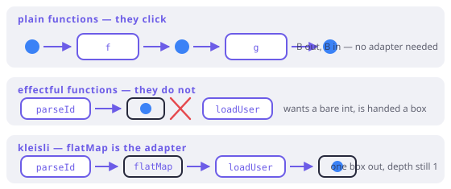

# Monad, in anger

> **In this chapter**
> - Kleisli composition: why `A → M<B>` functions need their own `∘`
> - the pyramid, and the syntax every language invents to flatten it
> - `async`/`await` read as do-notation for exactly one monad
> - why "one monad at a time" is the real limit, and what it costs in Dart

## Functions that return boxes do not compose

Chapter 4 composed `A → B` with `B → C` and got `A → C`. Try the same with
steps that can fail:

- `parseId : String → Either<E, int>`
- `loadUser : int → Either<E, User>`

They do not line up. `parseId`'s output is `Either<E, int>`, and `loadUser`
wants a bare `int`. Ordinary composition is off the table, and this is not an
edge case — *every* effectful step has this shape.

`flatMap` is the fix, and giving it a composition operator makes the pattern
visible:

```dart run
import 'package:fxdart/fxdart.dart';

// Kleisli composition: compose two "returns a box" functions.
Either<E, C> Function(A) kleisli<E, A, B, C>(
  Either<E, B> Function(A) f,
  Either<E, C> Function(B) g,
) =>
    (a) => f(a).flatMap(g);

Either<String, int> parseId(String s) {
  final n = int.tryParse(s);
  return n == null ? Either.left('bad id: $s') : Either.right(n);
}

Either<String, String> loadUser(int id) =>
    id == 1 ? Either.right('Ada') : Either.left('no user $id');

void main() {
  final lookup = kleisli(parseId, loadUser);
  print(lookup('1'));
  print(lookup('2'));
  print(lookup('x'));
}
```

`kleisli` composes `A → M<B>` with `B → M<C>` into `A → M<C>`. Those arrows
form their own category — the **Kleisli category** of the monad — and the three
laws from Chapter 1 are exactly what a category needs: `of` is the identity
arrow (left and right identity), and `flatMap` is associative composition.

That is the whole content of "a monad is a way to compose effectful functions":
`flatMap` restores composition after effects break it.



*Figure 7-1. Plain functions click together. Effectful ones do not — the output has a wrapper the next input cannot accept. `flatMap` is the adapter, and the laws say the adapter is invisible.*

## The pyramid, and four ways out

Compose three or four dependent steps by hand and the code drifts right:

```dart
parseId(raw).flatMap((id) =>
    loadUser(id).flatMap((user) =>
        loadOrders(user).flatMap((orders) =>
            Either.right(summarise(user, orders)))));
```

Every language with monads eventually grows syntax that flattens this. Same
computation, four surfaces:

| Language | Syntax | What the compiler emits |
|---|---|---|
| Haskell | `do { id <- parseId raw; … }` | `>>=` chain |
| Scala | `for { id <- parseId(raw) } yield …` | `flatMap`/`map` chain |
| Kotlin (Arrow) | `either { val id = parseId(raw).bind() }` | a scope with a non-local exit |
| Dart | `either((r) { final id = r.bind(parseId(raw)); … })` | a scope with a non-local exit |

The first two are *desugaring*: the compiler rewrites the block into method
calls, and it works for any monad the type checker can name. The last two are
not — there is no rewrite, just a scope object whose `bind` can abandon the
block. Chapter 15 is about that mechanism and why Dart forced it.

The result reads the same either way:

```dart run
import 'package:fxdart/fxdart.dart';

Either<String, int> parseId(String s) {
  final n = int.tryParse(s);
  return n == null ? Either.left('bad id: $s') : Either.right(n);
}

Either<String, String> loadUser(int id) =>
    id == 1 ? Either.right('Ada') : Either.left('no user $id');

Either<String, List<String>> loadOrders(String user) =>
    user == 'Ada'
        ? Either.right(['mug', 'book'])
        : Either.left('none');

Either<String, String> summary(String raw) => either((r) {
      final id = r.bind(parseId(raw));
      final user = r.bind(loadUser(id));
      final orders = r.bind(loadOrders(user));
      return '$user bought ${orders.length} things';
    });

void main() {
  print(summary('1'));
  print(summary('2'));
  print(summary('nope'));
}
```

Straight-line code, three dependent steps, one failure type, and no pyramid.

## `async`/`await` is do-notation for one monad

Dart already ships this idea — for `Future`, and only for `Future`:

```dart run
Future<int> parseId(String s) async => int.parse(s);
Future<String> loadUser(int id) async =>
    id == 1 ? 'Ada' : 'nobody';

Future<String> summary(String raw) async {
  final id = await parseId(raw); // r.bind, spelled `await`
  final user = await loadUser(id);
  return 'user: $user';
}

void main() async {
  print(await summary('1'));
  print(await summary('7'));
}
```

Line for line, this is the `either` block above with `await` where `r.bind`
was. `async` marks the scope; `await` unwraps one layer; the compiler rewrites
the body into continuations, which is `flatMap` by another name. The evidence
that it is monadic and not magic: `await` on a `Future<Future<T>>` gives you
`Future<T>` — flattening, exactly as Chapter 1 required.

What Dart did *not* do is generalise it. `await` works on `Future` (and
anything with a `then`, by structural luck), and there is no `await` for
`Either`, no `await` for `Iterable`, no way to write your own. Every language
in the table above made the same choice at first and then generalised;
Dart's `async` is where that generalisation stopped.

> 🎓 **Monads do not stack.** Given `Future<Either<E, A>>` you have two monads
> and no single `flatMap` for the pair. Scala reaches for *monad transformers*
> (`EitherT[Future, E, A]`), a wrapper per combination, with a tower of lifts.
> Kotlin and Dart avoid the tower by making the scope do double duty:
> `eitherAsync` gives you a `Raise` scope *inside* an `async` body, so `await`
> handles time and `r.bind` handles failure, with no third type. It is not more
> powerful than transformers — it is less general and much easier to read, and
> Chapter 21 records who paid what for that trade.

## One monad at a time

```dart run
import 'package:fxdart/fxdart.dart';

Future<Either<String, int>> fetchPort(String key) async =>
    key == 'http'
        ? Either.right(8080)
        : Either.left('unknown: $key');

Future<Either<String, String>> describe(String key) =>
    eitherAsync((r) async {
      // `await` sequences time; `r.bind` sequences failure.
      final port = r.bind(await fetchPort(key));
      return 'listening on $port';
    });

void main() async {
  print(await describe('http'));
  print(await describe('gopher'));
}
```

Two effects, one straight-line block, no `EitherT`. The cost is that this only
works for the combinations FxDart wrote by hand — `eitherAsync`, `nullable`,
`catching`. There is no generic mechanism you can extend, because expressing
"any monad" needs a type feature Dart does not have. That is Chapter 10.

## When this earns its keep

Reach for the scope whenever three or more dependent steps can fail with the
same error type — parse, load, authorise, compute. That is the shape where the
pyramid appears, and the shape where a hand-rolled `if (x == null) return null`
chain quietly loses the reason for failing.

Do not reach for it when the steps are independent (Chapter 6: you lose
accumulation and concurrency), when there is exactly one step (a plain
`Either.map` says more), or when the failure is genuinely exceptional and the
caller cannot act on it (Chapter 18).

## Exercises

1. Write `kleisli` for `Future` — compose `A → Future<B>` with
   `B → Future<C>`. Which existing Dart method is it a thin wrapper around?
2. The Kleisli identity arrow for `Either` is `Either.right`. Show that
   `kleisli(Either.right, f)` and `kleisli(f, Either.right)` both behave like
   `f`, and name the two monad laws you just used.
3. Rewrite the `summary` block using only `flatMap`, then count the lines and
   the maximum indentation of each version. At how many steps does the scope
   version start to win?
4. `await` flattens `Future<Future<T>>`. What does that tell you about
   `Future.then`'s type signature, compared with the `map` of Chapter 5?

## Solutions

1. `Future<C> Function(A) k<A, B, C>(Future<B> Function(A) f,
   Future<C> Function(B) g) => (a) => f(a).then(g);`. It wraps `then`, which is
   `Future`'s `flatMap` — the same method that also serves as its `map`, which
   is the subject of exercise 4.
2. `kleisli(Either.right, f)` applied to `a` is `Either.right(a).flatMap(f)`,
   which is `f(a)` by **left identity**. `kleisli(f, Either.right)` applied to
   `a` is `f(a).flatMap(Either.right)`, which is `f(a)` by **right identity**.
   Those two laws are precisely the statement that `of` is an identity arrow in
   the Kleisli category.
3. The `flatMap` version is roughly the same line count but nests three levels
   deep and ends in a run of closing parens; the scope version stays flat. The
   crossover is two steps — at three it is not close, and at four the pyramid
   version starts collecting bugs in the parentheses.
4. `then` is overloaded in a way `map` is not: it accepts both `B Function(A)`
   and `Future<B> Function(A)`, and flattens in the second case. So `then` is
   `map` and `flatMap` fused into one method, which is convenient and is also
   why `Future` alone never teaches you the difference between the two floors
   of the tower.
