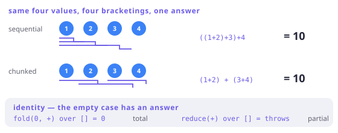

# Monoid and semigroup

> **In this chapter**
> - two laws — associativity and identity — and what each one buys separately
> - why `reduce` throws on empty and `fold` does not
> - the property that makes parallel and chunked reduction give the same answer
> - `NonEmptyList` as a semigroup, and why FxDart's errors accumulate into one

## The smallest useful algebra

A **semigroup** is a type with an associative binary operation:

`combine(a, combine(b, c)) == combine(combine(a, b), c)`

A **monoid** is a semigroup with an identity element:

`combine(empty, a) == a == combine(a, empty)`

That is all. `int` with `+` and `0`; `int` with `*` and `1`; `String` with `+`
and `''`; `List` with `+` and `[]`; `bool` with `&&` and `true`. You have used
every one of them today.

```dart run
void main() {
  // associativity: grouping does not matter
  print((1 + 2) + 3 == 1 + (2 + 3));
  print(('a' + 'b') + 'c' == 'a' + ('b' + 'c'));

  // identity: the neutral element changes nothing
  print(0 + 7 == 7 && 7 + 0 == 7);
  print(''.length + 'abc'.length == 3);

  // subtraction is neither associative nor unital
  print((10 - 3) - 2 == 10 - (3 - 2));
}
```

The last line is the point of the definition: "combine two things" is not
enough. Subtraction combines two `int`s and is useless for the jobs below.

## What each law buys

**Identity gives you the empty case.** This is why Dart has two folding
methods and they behave differently on an empty collection:

```dart run
import 'package:fxdart/fxdart.dart';

void main() {
  // fold carries the identity element as a seed — total, always.
  print(fx(<int>[]).fold<int>(0, (a, b) => a + b));
  print(fx([1, 2, 3]).fold<int>(0, (a, b) => a + b));

  // reduce has no seed, so the empty case has no answer to give.
  try {
    print(fx(<int>[]).reduce((a, b) => a + b));
  } catch (e) {
    print('reduce on empty: ${e.runtimeType}');
  }
}
```

`reduce` requires only a semigroup and is therefore partial. `fold` requires a
monoid — you supply `empty` as the seed — and is total. The exception you have
hit a hundred times is a missing identity element, showing up at runtime.

**Associativity gives you freedom of grouping**, and that is worth more than it
sounds. It means the same operation can be run:

- left to right, one element at a time (a normal fold);
- in chunks, combining the chunk results afterwards;
- in parallel, on several isolates, combining as results arrive;
- incrementally, keeping a running total and adding to it later.

All four give the same answer, and *only* associativity guarantees it.



*Figure 8-1. Associativity says every bracketing of the same sequence lands on the same value. That is the licence for chunking, for parallel reduction, and for resuming a running total.*

```dart run
import 'package:fxdart/fxdart.dart';

void main() {
  final data = List.generate(12, (i) => i + 1);

  // Sequential.
  final straight = fx(data).fold(0, (a, b) => a + b);

  // Chunked, then the chunk results combined — legal because +
  // is associative and 0 is its identity.
  final chunked = fx(data)
      .chunk(5)
      .map((c) => fx(c).fold(0, (a, b) => a + b))
      .fold(0, (a, b) => a + b);

  print([straight, chunked, straight == chunked]);

  // Order does NOT come free: subtraction disagrees with itself.
  final subStraight = fx(data).fold(0, (a, b) => a - b);
  final subChunked = fx(data)
      .chunk(5)
      .map((c) => fx(c).fold(0, (a, b) => a - b))
      .fold(0, (a, b) => a - b);
  print([subStraight, subChunked, subStraight == subChunked]);
}
```

## Commutativity is a *different* law

Associativity says grouping does not matter. **Commutativity** — `a + b == b + a` —
says *order* does not matter, and most useful monoids do not have it. String
concatenation, list append, and function composition are all associative and
none is commutative.

The distinction has teeth in FxDart's async chapter: `concurrent(n)` evaluates
elements out of order but emits them **in source order**, precisely so that a
downstream fold only needs associativity and not commutativity. A library that
delivered results in completion order would be silently demanding the stronger
law from your code.

## `NonEmptyList`, and why errors are a semigroup

Chapter 6 accumulated validation errors. Ask what type they accumulate *into*
and the algebra answers before you do: you need something you can combine
associatively (two failed branches concatenate), and the result of combining
failures is never empty — so identity is not merely unnecessary, it would be a
lie.

That is a semigroup without a monoid, and FxDart names it `NonEmptyList`:

```dart run
import 'package:fxdart/fxdart.dart';

void main() {
  final a = NonEmptyList.of('name is empty');
  final b = NonEmptyList.of(
      'age is negative', ['age is not a number']);

  // Combining failures is list concatenation: associative,
  // and the result cannot be empty.
  final all = NonEmptyList.of(a.first, [...a.skip(1), ...b]);
  print(all.toList());
  print('length: ${all.length}');

  // Nel is an extension type over List, so it costs nothing at
  // runtime — and `orNull` is the only way in from a plain list.
  print(NonEmptyList.orNull(<String>[]));
}
```

`Either<Nel<E>, A>` therefore reads as a precise claim: *if this failed, there
is at least one reason, and reasons combine.* A `List<E>` would have admitted
the nonsense state "failed with zero errors" — Chapter 3's argument, applied to
the error channel.

> 🎓 **Monoids compose, which is why they are everywhere.** If `A` and `B` are
> monoids then so is `(A, B)`, combining componentwise with `(emptyA, emptyB)`
> as identity — so "sum, count, and max in one pass" is a single fold over a
> product monoid, and an average is that fold plus a division. Functions into a
> monoid form a monoid (`(f + g)(x) = f(x) + g(x)`), and endofunctions form a
> monoid under composition with `identity` as the unit — which is the sentence
> hiding inside "a monad is a monoid in the category of endofunctors": `flatten`
> is the combine, `of` is the identity, and the three monad laws of Chapter 1
> are these two laws in disguise.

## When this earns its keep

Whenever you write a `fold`, you are choosing a monoid, and naming it out loud
tells you whether the code is right: does it have an identity (what should the
empty case return?), and is it associative (may the work be split)?

It pays hardest at scale — chunked processing, parallel aggregation,
incremental totals in a database — and in API design, where "give me a seed and
a combine" is the interface that lets a library batch your work without asking.

It does not pay as vocabulary in a codebase that does one `reduce` over ten
elements. Say "sum" there.

## Exercises

1. Is `max` a semigroup on `int`? A monoid? What would the identity element
   have to be, and does Dart have it?
2. Give a monoid whose `empty` is not the "obviously empty" value — that is,
   where a reader would guess wrong.
3. `fx(xs).fold(0, (a, b) => a + b.length)` sums string lengths. Is the
   function you passed to `fold` associative? Why is that not a problem?
4. Both `Either` accumulation and `Future.wait` combine independent results.
   Which monoid is `Future.wait` using, and what does it do with failures?

## Solutions

1. Yes and yes. `max` is associative and commutative; its identity is negative
   infinity, which for `int` does not exist in Dart — so `max` is a *semigroup*
   on `int` and a monoid only on `double` (`double.negativeInfinity`) or on
   `int?` with `null` as the identity. That is the honest reason `reduce` is
   the natural fit for `max` and `fold` needs an awkward seed.
2. Several: `bool` under `&&` has identity `true`, not `false`; `int` under `*`
   has identity `1`, not `0`; and the "first non-null" monoid has identity
   `null`. The lesson is that `empty` is determined by the operation, never by
   the type — guessing from the type is how a fold ends up multiplying
   everything by zero.
3. It is not associative — it is not even the right shape, since the seed type
   `int` differs from the element type `String`. `fold` in Dart is the more
   general *catamorphism* `(B, A) → B`, and only when `B == A` does the monoid
   question arise. It is not a problem because the sequential fold never
   regroups; it becomes a problem the moment you want to chunk it, at which
   point you must factor the operation into a genuine monoid (`String → int`,
   then sum).
4. `Future.wait` uses the list monoid on results — concatenating them in
   argument order, with `[]` as identity (waiting on nothing gives an empty
   list). Failures are *not* accumulated: by default the first error wins and
   the rest are dropped, which is the fail-fast behaviour Chapter 6 contrasted
   with `zipOrAccumulate`. `eagerError: false` changes when it reports, not how
   many it reports.
