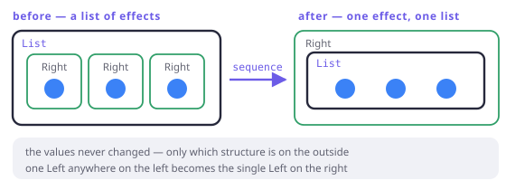

# Traverse

> **In this chapter**
> - the swap: `List<Either<E, A>>` → `Either<E, List<A>>`, and why you keep needing it
> - `traverse` = map + sequence, and what the applicative contributes
> - fail-fast and fail-slow versions, and the honest cost of each
> - the async twin, and where `traverse` meets `concurrent(n)`

## The shape you keep hand-rolling

Validate ten rows and you have `List<Either<E, Row>>`. Nothing downstream wants
that: the caller wants either every row, or the reasons it cannot have them.
Written by hand it is the same fifteen lines every time — an accumulator, a
loop, an early return.

The operation has a name, **sequence**, and its generalisation — map first,
then sequence — is **traverse**:

```
sequence : List<F<A>>              → F<List<A>>
traverse : List<A> × (A → F<B>)    → F<List<B>>
```

Read it as *swapping the two structures*. The list stays a list, the effect
stays an effect; which one is on the outside changes.



*Figure 9-1. Every element carries its own little effect; after the swap, one effect carries the whole list. The values are unchanged — only the nesting is.*

```dart run
import 'package:fxdart/fxdart.dart';

Either<String, int> parsePort(String s) {
  final n = int.tryParse(s);
  if (n == null) return Either.left('not a number: $s');
  if (n < 1024) return Either.left('privileged: $n');
  return Either.right(n);
}

void main() {
  // traverse: map each element to an Either, then swap.
  print(fx(['8080', '9000']).map(parsePort).sequence());
  print(fx(['8080', 'x', '80']).map(parsePort).sequence());
}
```

One value out, and it is the value the rest of the program wants: `Right` with
every port, or `Left` with the first reason there is no list at all.

## Why it needs an applicative, not just a functor

`map` alone cannot do this. Mapping over the list gives you effects *inside*,
and nothing about `map` can move one out. To build `F<List<A>>` you must
combine the element effects with each other — that is `map2` from Chapter 6,
applied repeatedly:

`sequence([a, b, c])` = `map2(a, map2(b, map2(c, of([]), cons), cons), cons)`

Which immediately explains the two behaviours you can get. The combining
operation is the applicative's, so **the applicative you traverse with decides
the failure policy**:

- Traverse with `Either`'s fail-fast applicative → stop at the first `Left`.
- Traverse with the accumulating applicative → collect every `Left`.

Same traversal, different algebra, different report. FxDart exposes both:

```dart run
import 'package:fxdart/fxdart.dart';

Either<String, int> parsePort(String s) {
  final n = int.tryParse(s);
  if (n == null) return Either.left('not a number: $s');
  if (n < 1024) return Either.left('privileged: $n');
  return Either.right(n);
}

void main() {
  final raw = ['8080', 'x', '80', '9000'];

  // Fail fast: the first reason, and nothing after it ran.
  print(fx(raw).map(parsePort).sequence());

  // Fail slow: every reason, in order.
  print(fx(raw).map(parsePort).flattenOrAccumulate());

  // And the map-and-swap in one step, with the accumulating
  // applicative doing the combining.
  print(mapOrAccumulate(
      (r, String s) => r.bind(parsePort(s)), raw));
}
```

There is a third thing you might want — *keep the good rows and report the bad
ones* — and that is not a traversal at all, because the result is two lists
rather than one effect. It has its own name:

```dart run
import 'package:fxdart/fxdart.dart';

Either<String, int> parsePort(String s) {
  final n = int.tryParse(s);
  return n == null ? Either.left('bad: $s') : Either.right(n);
}

void main() {
  final results = ['8080', 'x', '9000'].map(parsePort).toList();
  final (bad, good) = separateEither(results);
  print('kept: $good');
  print('dropped: $bad');

  // …or take just one side.
  print(rights(results));
  print(lefts(results));
}
```

Choosing between them is a product decision, not a technical one: an import
tool wants `separateEither`, a config loader wants `flattenOrAccumulate`, an
API handler wants `sequenceEither`.

## The async twin

Swap `Future` in for `Either` and the same operation appears wearing Dart's own
clothes: `Future.wait` **is** `sequence` for futures. Which means the
interesting version is the one that traverses *and* bounds the work:

```dart run
import 'package:fxdart/fxdart.dart';

Future<int> fetchSize(String url) async {
  await Future.delayed(const Duration(milliseconds: 20));
  return url.length;
}

void main() async {
  final urls = ['a.com', 'bb.com', 'ccc.com', 'dddd.com'];

  // Sequence with unbounded concurrency: Future.wait.
  print(await Future.wait(urls.map(fetchSize)));

  // Traverse with *bounded* concurrency: three in flight,
  // results still in source order.
  final bounded =
      fx(urls).toAsync().mapConcurrent(3, fetchSize);
  print(await bounded.toList());
}
```

`Future.wait` is the applicative traversal with no throttle: it starts
everything. `mapConcurrent(n)` is the same traversal with a limit, which is
what you actually want against a rate-limited API. Chapter 13 explains the
back-channel that makes the limit real rather than advisory.

> 🎓 **Traverse is more general than lists.** The full signature is
> `traverse : T<A> × (A → F<B>) → F<T<B>>` for any *traversable* container `T`
> and any applicative `F` — trees, maps, and `Option` are traversable too. It
> has two laws (identity and composition, like the functor's) and one famous
> corollary: `traverse` with the identity applicative is just `map`, and with
> the constant applicative it is `fold`. `map`, `fold` and `traverse` are three
> faces of one operation — which is a beautiful result, and requires
> higher-kinded types to state even once. That is Chapter 10's subject, and
> the reason FxDart ships four concrete traversals instead of one generic one.

## The cost of not having it generically

Count the versions in the code above: `sequenceEither`,
`flattenOrAccumulate`, `mapOrAccumulate`, `separateEither` — plus
`sequenceEitherAsync`, `flattenOrAccumulateAsync`, and `mapOrAccumulateAsync`
for chains that are asynchronous. Seven functions where a language with
higher-kinded types writes one.

That is not incompetence, it is the language's ceiling, and it has a real cost
to you: when FxDart adds a new effect type, none of your existing traversals
work with it until someone writes the seventh, eighth and ninth variants by
hand.

## When this earns its keep

Any boundary where a collection of independent, fallible things must become one
decision: parsing a config file, validating an import, loading N records,
fanning out to N services. If you have written `for (final x in xs) { final r =
f(x); if (r.isLeft) return r; out.add(...); }` more than twice, that is a
traversal and you should say so.

Skip it when the collection is one element (just use the `Either` directly),
when you need partial success semantics (that is `separateEither`), or when the
loop genuinely does something per-element that is not a pure map — a traversal
that hides a side effect is worse than the loop it replaced.

## Exercises

1. What is `sequence` on an empty list — for `Either`, and for `Future`? Which
   law of Chapter 8 decides the answer?
2. `traverse(xs, f)` and `xs.map(f)` followed by `sequence` give the same
   result. Which is cheaper in Dart, and why does FxDart still ship both
   spellings?
3. You have `Either<E, List<A>>` and want `List<Either<E, A>>` — the swap in
   the other direction. Is that always possible? Try it for a `Left`.
4. `Future.wait` starts every future immediately. Write down two situations
   where that is exactly right, and two where `mapConcurrent(n)` is the only
   correct choice.

## Solutions

1. `Right([])` and `Future.value([])` — the empty list wrapped in the
   applicative's `pure`. The identity element of Chapter 8's list monoid is
   `[]`, and `sequence` of nothing must produce the identity; anything else
   would break the composition of two traversals over concatenated inputs.
2. They are the same work; `traverse` avoids building the intermediate
   `List<F<B>>`, which matters at scale but not at ten elements. FxDart ships
   both because the two-step form composes into an existing lazy chain
   (`.map(f).sequenceEither()`), while the fused form is the one you want when
   the source is already materialised.
3. Yes, but the interesting case is `Left(e)`: it maps to `[Left(e)]`? Or to
   `[]`? Both are defensible, which is the tell that this direction is *not* a
   traversal — there is no law forcing the answer. The general swap
   `F<T<A>> → T<F<A>>` is called a *distributive law* and exists only for
   particular pairs of structures.
4. Right: a handful of fast local computations; a fan-out where the remote side
   is explicitly built for parallel load. Wrong: any rate-limited or paid API
   (unbounded fan-out gets you throttled or billed), and any list whose length
   is user-controlled — `Future.wait` over a 100k-element list opens 100k
   sockets, and the failure mode is your process, not theirs.
