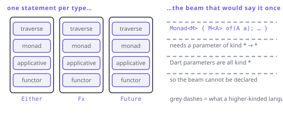

# The missing floor

> **In this chapter**
> - kinds: the types of types, and where `List` sits without its argument
> - the exact Dart declaration that does not compile, and why no trick recovers it
> - what Scala, Haskell and Kotlin's Arrow do instead
> - the bill FxDart pays, counted in functions

## Kinds

Values have types. Types have **kinds**.

`int` is a complete type: you can declare a variable of it. Its kind is written
`*`. `List` on its own is *not* a complete type — `List<int>` is. `List` is a
function from types to types, and its kind is written `* → *`.

| Thing | Kind | Complete? |
|---|---|---|
| `int`, `String`, `List<int>` | `*` | yes |
| `List`, `Future`, `Fx` | `* → *` | needs one argument |
| `Either`, `Map` | `* → * → *` | needs two |

Chapters 5 to 9 were all about types of kind `* → *`: functor, applicative,
monad and traversable are properties of a *type constructor*, not of a type.
`List<int>` is not a monad; `List` is.

That sentence is the whole chapter. To write the interface down, you need a
type parameter that is itself of kind `* → *` — a **higher-kinded type**.

## The line where Dart stops

```dart
// Does not compile. Dart type parameters are always kind `*`,
// so `M` is a complete type and cannot take an argument.
abstract class Monad<M> {
  M<A> of<A>(A value);
  M<B> flatMap<A, B>(M<A> box, M<B> Function(A) f);
}
```

The error is not about syntax. Dart's type variables range over *complete*
types only, so `M<A>` is meaningless in the same way `3(4)` is meaningless. It
is a deliberate design point — first-order generics keep inference decidable
and error messages readable — and it is a ceiling, not a bug to be worked
around.



*Figure 10-1. Every floor of the tower is a statement about a type constructor. Dart can talk about the floors one type at a time; the beam that would carry all of them at once needs a kind the language does not have.*

The workarounds all fail in the same way — they compile, and then they lie:

```dart run
// The "defunctionalisation" trick: erase the constructor to a
// marker, then cast it back. It type-checks. It is not typed.
abstract class Kind<F, A> {}

class ListK<A> implements Kind<ListK<Never>, A> {
  ListK(this.value);
  final List<A> value;
}

abstract class Monad<F> {
  Kind<F, A> of<A>(A value);
  Kind<F, B> flatMap<A, B>(
      Kind<F, A> fa, Kind<F, B> Function(A) f);
}

class ListMonad implements Monad<ListK<Never>> {
  @override
  Kind<ListK<Never>, A> of<A>(A value) => ListK([value]);

  @override
  Kind<ListK<Never>, B> flatMap<A, B>(
    Kind<ListK<Never>, A> fa,
    Kind<ListK<Never>, B> Function(A) f,
  ) {
    // The cast is the whole problem: nothing checks it.
    final list = (fa as ListK<A>).value;
    return ListK(list
        .expand((a) => (f(a) as ListK<B>).value)
        .toList());
  }
}

void main() {
  final m = ListMonad();
  final r = m.flatMap<int, int>(
      m.of(3), (a) => ListK([a, a * 10]));
  print((r as ListK<int>).value);
}
```

It works, and look at the price: three casts, a `Never` phantom, and a return
type — `Kind<ListK<Never>, int>` — that no caller wants. Every use site casts
back to the real type, so the abstraction hands you generic code whose
type errors surface at runtime. Arrow's early versions did exactly this, in
Kotlin, and then abandoned it. FxDart's `ARROW_MIGRATION_BLOCKER.md` records
the same conclusion for Dart.

## What other languages do

- **Haskell** has kinds in the language. `class Monad m where (>>=) :: m a → (a → m b) → m b`
  is ordinary code, and every instance is checked against it.
- **Scala** has higher-kinded type parameters (`F[_]`), which is why Cats can
  define `Traverse[F[_]]` once and get every combinator for free.
- **Kotlin** has neither, and **Arrow 1.x** used the `Kind` encoding above. Arrow
  2.x deleted it: the ergonomics were bad enough that the team chose concrete
  types plus *context receivers* and a `Raise` scope instead — the design FxDart
  ports.
- **Dart** has neither, and no plugin system that could add one. FxDart
  therefore writes the concrete cases, and says so.

> 🎓 **What is actually lost.** Not expressiveness — every program you can write
> with an HKT abstraction can be written without it, by hand, per type. What is
> lost is *abstraction over the abstraction*: one `traverse` instead of seven,
> one `sequence`, one set of laws to test once. In a language with HKTs a new
> effect type arrives already equipped with the whole library; in Dart it
> arrives empty, and someone has to fill it in. The difference is library
> maintenance cost, not program capability — which is precisely why it is a
> reasonable language design choice and still an irritating one.

## The bill, counted

Every abstraction in Part II that a higher-kinded language writes once, FxDart
writes per type. Concretely, for one operation — traversal — the library ships:

```dart run
import 'package:fxdart/fxdart.dart';

void main() {
  final xs = <Either<String, int>>[
    Either.right(1),
    Either.left('bad'),
    Either.right(3),
  ];

  // Four spellings of "swap the structures", because there is no
  // way to write one that works for every effect type.
  print(sequenceEither(xs));
  print(flattenOrAccumulate(xs));
  print(separateEither(xs));
  print(fx(xs).sequence());
  // …plus sequenceEitherAsync, flattenOrAccumulateAsync,
  //   mapOrAccumulateAsync for the async chain.
}
```

And the flip side, so the trade is honest: because these are concrete, they are
*fast* and their types are exact. `sequenceEither` returns
`Either<L, List<R>>` — not `Kind<F, List<R>>`, not a wrapper you have to
unpick. Dart's inference works, the editor completes, the errors point at your
code. A generic version in the `Kind` encoding would return something no reader
can use without a cast.

## When this matters to you

Mostly it does not — until you go looking for the generic combinator that
"obviously" should exist. This chapter is the answer to that search: it does not
exist, it cannot exist, and the concrete version is over there.

It matters when you design a library. If you catch yourself trying to abstract
over "any container with a `map`", stop: in Dart, write the two or three
concrete versions and name them well. The abstraction you are reaching for will
cost more than it returns.

It also matters when you read Haskell or Scala for ideas — which is worth
doing. Just translate structurally, not literally: their one-line generic
definitions become your concrete methods, and the laws survive the translation
even when the polymorphism does not.

## Exercises

1. What is the kind of `Map`? Of `Map<String, dynamic>`? Of a hypothetical
   `Traverse` interface?
2. Extend the `Kind` encoding above to `Either` and write `flatMap` for it.
   How many casts do you need, and where would a wrong one blow up?
3. `Fx<T>` has `map`, `flatMap` and `sequence`-style terminals. Can you write a
   function that accepts "any FxDart type with a `map`" without using `dynamic`
   or a common supertype? Explain the answer in terms of kinds.
4. Dart *does* let you write `T extends Comparable<T>`. Why is that not a
   counterexample to this chapter?

## Solutions

1. `Map` is `* → * → *` (two arguments); `Map<String, dynamic>` is `*`;
   `Traverse` would be `(* → *) → *` — it takes a *type constructor* and
   produces a type. That last kind is exactly what Dart cannot spell, and the
   parenthesis is where the language stops.
2. Two casts minimum — one to unwrap `Kind<F, A>` into `EitherK<E, A>`, one on
   the result of `f`. They blow up at runtime, when someone passes a `ListK`
   into an `Either` monad instance: the type system was never watching, since
   both erase to `Kind<F, _>`.
3. No. Such a function needs a parameter of kind `* → *` ("some `F` such that
   `F<A>` has a `map`"), and Dart parameters are all kind `*`. The available
   workarounds are exactly the three bad ones: `dynamic`, a shared supertype
   (which `Fx` and `Either` do not have and should not), or the `Kind` cast
   encoding.
4. `T extends Comparable<T>` constrains a *complete* type — `T` is still kind
   `*`, and `Comparable<T>` is a bound on it, not a higher-kinded parameter.
   F-bounded polymorphism is a different feature that solves a different
   problem, and it is a good illustration that "generic enough for most code"
   and "higher-kinded" are separate axes.
