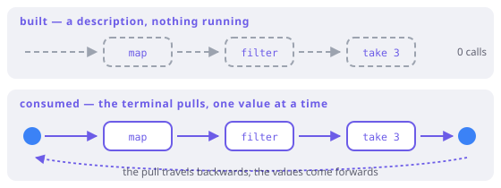

# Laziness

> **In this chapter**
> - descriptions versus executions, and which operators are which
> - the cost model: work is proportional to what you *consume*, not what you *write*
> - why laziness cannot change any law from Part II
> - the two real hazards: effects in a pipeline, and a source that can only be read once

## Two kinds of operator

Write a chain and nothing happens:

```dart run
import 'package:fxdart/fxdart.dart';

void main() {
  var calls = 0;
  final chain = fx([1, 2, 3, 4, 5]).map((n) {
    calls++;
    return n * 2;
  });

  print('after building the chain: $calls calls');
  print(chain.toList());
  print('after consuming it: $calls calls');
}
```

`map`, `filter`, `take`, `chunk`, `zip` are **lazy** — each returns a new
description with one more stage. `toList`, `each`, `fold`, `first`, `sum` are
**terminal** — they pull values through, and only then does anything run.

The rule for telling them apart is the return type, and it never lies: if you
get another `Fx` back, nothing happened yet.



*Figure 11-1. The dashed chain is a plan: stages wired together, no values in motion. The terminal operator is what pulls, and a value travels the whole chain before the next one starts.*

## The cost model

Because the terminal decides how much to pull, work is proportional to what you
*consume*:

```dart run
import 'package:fxdart/fxdart.dart';

void main() {
  var evaluated = 0;

  final result = fx(range(1, 1000000))
      .map((n) {
        evaluated++;
        return n * n;
      })
      .filter((n) => n.isOdd)
      .take(3)
      .toList();

  print(result);
  print('elements evaluated: $evaluated of 999,999');
}
```

Five evaluations for three results out of a million candidates. The eager
version of that program builds a million-element list, then filters it into
another list, then throws all but three away.

This is the difference that shows up in FxDart's own benchmark suite as the
cases where the pipeline *beats* a hand-written loop — the loop is usually
faster per element, but the lazy chain refuses to do the work at all. Chapter 14
puts numbers on both directions.

Two more consequences fall out of the same model:

- **Infinite sources are ordinary.** A description of infinitely many values is
  finite; only the pull has to stop.
- **Short-circuit is automatic.** `first`, `any`, `find` stop the pull as soon
  as they have an answer, with no special support from the stages upstream.

```dart run
import 'package:fxdart/fxdart.dart';

void main() {
  // An endless cycle, consumed finitely.
  print(fx([1, 2, 3]).cycle().take(7).toList());

  // `some` stops pulling at the first match.
  var checked = 0;
  final found = fx(range(1, 1000)).some((n) {
    checked++;
    return n > 4;
  });
  print([found, checked]);
}
```

## Laziness cannot change meaning

This is the part worth being explicit about, because it is what makes laziness
safe to rely on. Every law in Part II is an equation between *values*: the
functor law says `m.map(f).map(g)` equals `m.map(g ∘ f)`, and equality of two
pipelines means they produce the same elements in the same order.

When does evaluation happen is not part of that equation. So:

- fusing two `map` stages is legal (functor composition law);
- reordering a `filter` before a `map` is legal *if* the predicate does not
  depend on the mapping — a genuine precondition, not a laziness issue;
- moving work from build time to pull time changes nothing observable — **as
  long as the callbacks are pure.**

That last clause is the whole catch, and it is Chapter 2's clause. In a pure
pipeline, laziness is invisible except in the bill. In an impure one, it is
visible everywhere, because *when* an effect happens is exactly what an effect
lets you observe.

```dart run
import 'package:fxdart/fxdart.dart';

void main() {
  final log = <String>[];

  // Built, never consumed: the effect never happens.
  final unused = fx([1, 2, 3]).map((n) {
    log.add('mapped $n');
    return n;
  });
  print('log after building: $log');

  // Same chain, consumed twice: the effect happens twice.
  final used = fx([1, 2]).map((n) {
    log.add('mapped $n');
    return n;
  });
  used.toList();
  used.toList();
  print('log after two pulls: $log');
  print(unused.take(0).toList());
}
```

Both surprises are the same surprise: a lazy chain is a *recipe*, and recipes
can be cooked zero times or twice.

> 🎓 **Lazy, strict, and what Haskell means by it.** Haskell is lazy by default
> at the level of *every expression*: a value is a thunk until forced, which
> gives you infinite data structures and `where` clauses that cost nothing when
> unused — and space leaks when a thunk chain grows unforced. Dart is strict; a
> lazy pipeline is laziness re-created at the level of *sequences*, and the
> mechanism is a pull protocol rather than thunks. The practical difference:
> you get the short-circuit and streaming benefits, you do not get (or have to
> debug) unbounded thunk accumulation, and `fx(xs).map(f)` composed twice is a
> plan, while `let y = f x` is already a thunk.

## The second hazard: single-use sources

A pipeline over a `List` can be pulled repeatedly — a list is re-readable. A
pipeline over a source that is consumed as it is read cannot:

```dart run
import 'package:fxdart/fxdart.dart';

Iterable<int> readOnce() sync* {
  // A generator: iterating it again starts over, but a *stream*
  // or a socket would not — that is the shape to watch for.
  yield 1;
  yield 2;
}

void main() {
  final chain = fx(readOnce()).map((n) => n * 10);
  print(chain.toList());
  print(chain.toList()); // fine here — the generator restarts

  // The rule that always holds: if you need the values twice,
  // materialise once and re-read the list.
  final materialised = chain.toList();
  print([materialised.length, materialised.first]);
}
```

The guidance is short: **consume once, or materialise.** If a chain is used by
two consumers, call `toList()` and share the list, or use `fork`/`tee`, which
exist precisely to split a pull into several without re-running the source.

## When this earns its keep

Laziness pays whenever the pipeline could produce more than you need: taking
the top N, searching for the first match, streaming a file you will stop
reading, composing filters whose combined selectivity is high. It also pays for
memory — one element in flight instead of one list per stage.

It costs when everything gets consumed anyway and the source is small: then the
per-element protocol is overhead against a plain loop, and Chapter 14 measures
exactly how much. And it costs in debuggability — a stack trace inside a lazy
chain shows iterator frames, not your pipeline, which is the price of the
indirection.

## Exercises

1. `fx(xs).map(f).toList()` and `xs.map(f).toList()` do the same work. At what
   point does the FxDart version start to win, and which operator in the chain
   is what causes it?
2. Predict the output of a chain that calls `peek(print)` before `take(2)` over
   a ten-element source. How many lines print, and why?
3. Write a chain whose callbacks run twice by accident. Then fix it two
   different ways.
4. `fx(range(1, 1000000)).map(expensive).first` — how many times does
   `expensive` run? What if `.first` is replaced by `.last`?

## Solutions

1. It wins as soon as a stage *discards* work the eager version has already
   done — `take`, `first`, `some`, `find`, or a `filter` that rejects most
   elements before an expensive `map`. With no such stage the two do identical
   work, and the eager version has less per-element machinery.
2. Two lines. `take(2)` stops pulling after the second element, so `peek` is
   never asked about elements three onwards — the pull is what drives the
   upstream, and it stopped.
3. Any chain assigned to a variable and consumed by two terminals, as in the
   listing above. Fix one: `final xs = chain.toList();` then use `xs` twice.
   Fix two: use `fork`/`tee` to split one pull into two consumers, so the
   source is still read once.
4. Once with `.first` — one pull satisfies it. With `.last`, all 999,999 times:
   `last` has to reach the end, so there is nothing left to skip. Same chain,
   same laziness, opposite cost, decided entirely by the terminal.
