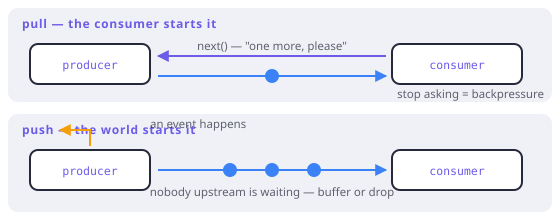

# Pull and push

> **In this chapter**
> - the duality: `Iterator` and `Stream` differ in who makes the call
> - what falls out of it — backpressure, cancellation, and time
> - why FxDart's async model is a pull protocol and not a `Stream`
> - the bridges, and how to pick a side for a given problem

## Who calls whom

```
pull:  consumer asks  → producer answers   iterator.moveNext()
push:  producer calls → consumer receives  stream.listen(onData)
```

That is the entire difference, and everything else in this chapter is a
consequence of it. A pull source is a *function you call*; a push source is a
*callback you register*.

| | Pull (`Iterable`, `FxAsyncIterable`) | Push (`Stream`) |
|---|---|---|
| Drives the pace | consumer | producer |
| Backpressure | free — just do not ask | must be arranged |
| Stop early | stop pulling | cancel a subscription |
| Time | not modelled | inherent |
| Natural fit | collections, files, paged APIs | UI events, sockets, timers |



*Figure 12-1. Same values, opposite arrows. In a pull chain the request travels upstream and the value comes back; in a push chain the value travels downstream and nobody upstream is waiting for permission.*

Formally these are duals — one is the mirror of the other with the arrows
reversed — which is why the operator vocabularies look so similar (`map`,
`filter`, `take`, `scan` on both sides) and the *failure modes* are opposites.

## Backpressure is the practical difference

If the consumer is slower than the producer, something has to give.

In a pull chain nothing gives, because the consumer's `next` call *is* the
clock. A slow consumer simply asks less often, and the producer is idle in
between:

```dart run
import 'package:fxdart/fxdart.dart';

void main() async {
  var produced = 0;

  final source = fx(range(1, 1000)).map((n) {
    produced++;
    return n;
  }).toAsync();

  // The consumer takes three and stops asking.
  final taken = await source.take(3).toList();

  print(taken);
  print('produced: $produced'); // not 999
}
```

In a push chain the producer keeps going regardless. Dart's `Stream` handles
this with pause/resume for the sources that support it, and buffers for the
ones that do not — which turns a rate mismatch into memory growth rather than a
compile error. The classic bug is a broadcast stream with a slow listener: the
queue grows, latency grows, and nothing in the types said so.

## Why FxDart is not built on `Stream`

FxDart's async sequences are `FxAsyncIterable` — a pull protocol —
because its signature feature needs the consumer to be in charge.

`concurrent(n)` asks the *upstream* to evaluate n elements at once. That
request has to travel backwards, from the consumer towards the source, which is
exactly the direction a pull protocol already has an arrow for. FxDart passes a
marker through `iterator.next(concurrent)`: the consumer says "give me the next
one, and by the way, run n of these in parallel", and every stage upstream can
honour or forward it.

There is no way to express that on a `Stream`. A push source is already
running; the consumer can only ask it to pause, not to *go wider*. You would
have to invent a side-channel — which is what the various `parallel` operators
in Rx-style libraries are — and then reconcile it with buffering and ordering
by hand.

```dart run
import 'package:fxdart/fxdart.dart';

Future<String> fetch(String id) async {
  await Future.delayed(const Duration(milliseconds: 40));
  return 'data-$id';
}

void main() async {
  final ids = ['a', 'b', 'c', 'd', 'e', 'f'];
  final sw = Stopwatch()..start();

  // One at a time: six 40ms waits, serially.
  await fx(ids).toAsync().map(fetch).toList();
  final serial = sw.elapsedMilliseconds;

  sw.reset();
  // Three at a time, results still in source order.
  final out =
      await fx(ids).toAsync().map(fetch).concurrent(3).toList();
  final concurrent = sw.elapsedMilliseconds;

  print(out.first);
  print('serial ~${serial}ms, concurrent(3) ~${concurrent}ms');
}
```

The pull protocol is what makes the second number roughly a third of the first
*without* buffering, without losing order, and without a second API. Chapter 13
is about the guarantees that come with it.

## The bridges

Being a pull library does not mean ignoring push. Real programs have both — a
UI event is genuinely a push, a database page is genuinely a pull — so FxDart
crosses in both directions:

```dart run
import 'package:fxdart/fxdart.dart';

void main() async {
  // push → pull: a Stream becomes a pull chain.
  final ticks = Stream.fromIterable([1, 2, 3, 4, 5]);
  final doubled =
      await fxStream(ticks).map((n) => n * 2).take(3).toList();
  print(doubled);

  // pull → push: a chain becomes a Stream for the framework.
  final asStream =
      fx([1, 2, 3]).toAsync().map((n) => n + 10).toStream();
  print(await asStream.toList());
}
```

FxDart also ships an explicitly push-shaped layer — `fxEvents`, with Rx-style
operators over plain `Stream`s — for the problems that genuinely are about time
and broadcast:

```dart run
import 'package:fxdart/fxdart.dart';

void main() async {
  final clicks =
      Stream.fromIterable(['a', 'a', 'b', 'b', 'b', 'c']);

  // Push-side operators: same names, producer-driven semantics.
  final out = await fxEvents(clicks)
      .map((s) => s.toUpperCase())
      .where((s) => s != 'B')
      .toList();
  print(out);
}
```

The rule of thumb for choosing: **who decides when the next value exists?** If
the answer is "the outside world", you are on the push side and should stay
there. If the answer is "whoever consumes it", pull is simpler and gives you
backpressure for free.

> 🎓 **Dual, precisely.** An iterator is `() → Option<(A, Iterator<A>)>` — the
> consumer applies it. An observer is `((A) → Unit) → Unit` — the producer
> applies your callback. Turn every arrow in one around and you get the other;
> that is the sense in which Rx was described by its designers as "the dual of
> `IEnumerable`". The duality also predicts which operators are hard on each
> side: `zip` is easy on pull (ask both, wait for both) and needs buffering on
> push, while `debounce` is natural on push (it is about elapsed time) and
> meaningless on pull, where nothing happens between requests.

## When each earns its keep

Pull, when the data is *there* and you decide the pace: collections, files,
paged HTTP, database cursors, anything you might stop reading early, anything
where "N at a time" is a policy you want to state.

Push, when the data *arrives* whether or not you are ready: user input,
websockets, sensors, timers, and anywhere several consumers must see the same
event. Trying to model a click stream as a pull sequence means writing a buffer
by hand, badly.

The mistake to avoid is converting to the other side just to reuse a familiar
operator name. Bridge when the *problem* changes shape, not when the vocabulary
feels nicer.

## Exercises

1. `take(3)` on a pull chain stops the producer. What is the equivalent on a
   `Stream`, and what happens to values that were already in flight?
2. Why is `debounce` unavailable on a pull chain? Describe what it would even
   mean, and which part is incoherent.
3. A paged HTTP API returns 100 rows per request. Model it both ways, then say
   which one makes "stop after the first match" cheaper — and by how many
   requests.
4. `Stream` has `asBroadcastStream`; pull chains have `fork`/`tee`. Both let
   two consumers see one source. What is the essential difference in what
   happens when one consumer is slow?

## Solutions

1. `subscription.cancel()`. Values already emitted are gone, and a value the
   producer is mid-way through computing is finished and discarded — the
   producer was never waiting for permission, so cancellation is a request, not
   a barrier. On a pull chain, "stop" is simply the absence of the next call,
   so nothing is in flight to discard.
2. `debounce` means "emit only if nothing else arrived within X". On a pull
   chain nothing arrives on its own: the next value exists exactly when you ask
   for it, so the window would always be empty and the operator would degrade
   into `map`. It is the clearest example of an operator that is *about* the
   producer's timing, which only push has.
3. Pull: an `FxAsyncIterable` that fetches a page when the consumer exhausts
   the current one. Push: a `Stream` that fetches pages as fast as it can.
   "Stop after the first match" costs exactly one request in the pull model if
   the match is on page one; the push version has usually already fetched
   several pages by then — the difference is unbounded and grows with latency.
4. `asBroadcastStream` gives every listener the same events at the producer's
   pace: a slow listener either buffers or drops, and it cannot slow the
   producer down. `fork`/`tee` split a *pull*, so the shared source advances
   only when both consumers have asked — the slow consumer holds the fast one
   back, which is backpressure working as designed, and is the right default
   when correctness matters more than liveness.
