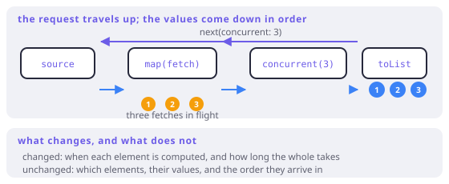

# Concurrency as an effect

> **In this chapter**
> - the guarantee: *when*, not *what* — and why that makes it composable
> - the back-channel that carries "go n wide" upstream
> - order preservation, and the cost of giving it up
> - the two ways to be wrong: sharing state, and unbounded fan-out

## One word, one guarantee

```dart run
import 'package:fxdart/fxdart.dart';

Future<int> slowSquare(int n) async {
  await Future.delayed(const Duration(milliseconds: 40));
  return n * n;
}

void main() async {
  final input = [1, 2, 3, 4, 5, 6];
  final sw = Stopwatch()..start();

  final serial =
      await fx(input).toAsync().map(slowSquare).toList();
  final serialMs = sw.elapsedMilliseconds;

  sw.reset();
  final wide = await fx(input)
      .toAsync()
      .map(slowSquare)
      .concurrent(3)
      .toList();
  final wideMs = sw.elapsedMilliseconds;

  print(serial);
  print(wide);
  print('same result: ${serial.toString() == wide.toString()}');
  print('serial ~${serialMs}ms, concurrent(3) ~${wideMs}ms');
}
```

Two identical lists, one of them produced in a third of the time. That is the
claim `concurrent(n)` makes, and it is worth stating exactly:

> `concurrent(n)` changes **when** elements are computed. It does not change
> **which** elements are computed, **what** they compute to, or **what order**
> they arrive in.

Everything downstream — folds, filters, the caller — cannot tell the
difference except by looking at a clock. Concurrency is added as an *effect on
evaluation*, not as a different program.

That is why it composes. Chapter 8's associativity is enough for a downstream
fold, because order is preserved; Chapter 6's independence is what makes the
overlap legal in the first place; and Chapter 2's purity is what makes it safe.
Each part of the tower shows up as a precondition here.

## The back-channel

Chapter 12 said a pull protocol has an arrow pointing upstream. This is what
FxDart sends along it.

An ordinary pull is "give me the next element". FxDart's async iterator takes
an argument: `iterator.next(concurrent)`, where `concurrent` is a marker
carrying a width. A stage that receives it may:

- honour it — start n upstream pulls at once, hold the results, and hand them
  out in order; or
- forward it — a `map` cannot parallelise anything by itself, so it passes the
  request further up.

The request therefore travels from the consumer to whichever stage can actually
widen, and the values come back down in order.



*Figure 13-1. `concurrent(3)` is not a buffer in the middle of the chain — it is a message that travels upstream until something can act on it. Three elements are in flight; the consumer still receives 1, 2, 3.*

This is also why the operator is placed *after* the expensive stage in the
chain and still affects it: the marker moves up. `map(fetch).concurrent(3)`
reads as "give me these fetched, three at a time", which is exactly what it
does. `mapConcurrent(3, fetch)` is the same thing pre-combined.

## Order, and what it costs to keep

Preserving order is not free: if element 2 finishes before element 1, its result
waits. In exchange you get a sequence that is *equal* to the serial one, which
is what lets you drop `concurrent(n)` into an existing pipeline without
re-reading the rest of it.

When you genuinely do not care, ask for completion order and get the results
sooner:

```dart run
import 'package:fxdart/fxdart.dart';

Future<String> job(String name, int ms) async {
  await Future.delayed(Duration(milliseconds: ms));
  return name;
}

void main() async {
  final jobs = [('slow', 90), ('quick', 10), ('mid', 45)];

  // Source order: 'slow' first, however long it takes.
  final ordered = await fx(jobs)
      .toAsync()
      .map((j) => job(j.$1, j.$2))
      .concurrent(3)
      .toList();
  print(ordered);

  // Completion order: whoever finishes first.
  final asDone = await fx(jobs)
      .toAsync()
      .map((j) => job(j.$1, j.$2))
      .concurrentPool(3)
      .toList();
  print(asDone);
}
```

`concurrentPool` is the honest name for "I am trading determinism for latency".
Use it when each result is handled independently — writing to a sink, updating
a UI — and never when a downstream step assumes positional alignment with the
input.

> 🎓 **Concurrency is not parallelism, and Dart makes that literal.** All of
> this happens on one isolate: a single thread interleaving continuations while
> IO waits. Nothing above makes CPU-bound code faster — six 40ms *computations*
> take 240ms with or without `concurrent`, because there is no second core in
> play. What overlaps is waiting. For genuine parallelism you need isolates,
> which cannot share mutable state and therefore make Chapter 2's purity a
> mechanical requirement rather than a discipline. The vocabulary is worth
> keeping straight: `concurrent(n)` bounds *in-flight work*; isolates buy
> *cores*.

## Two ways to be wrong

**Sharing mutable state across callbacks.** With `concurrent(n)`, n callbacks
are in flight at once and their interleaving is not specified. A counter
incremented inside `map` is fine on one isolate (no preemption between
statements), but a read-modify-write *across an await* is not:

```dart run
import 'package:fxdart/fxdart.dart';

void main() async {
  var balance = 100;

  // Each callback reads, awaits, then writes — the read is stale
  // by the time the write happens.
  await fx([1, 2, 3])
      .toAsync()
      .map((n) async {
        final read = balance;
        await Future.delayed(const Duration(milliseconds: 10));
        balance = read - 10;
        return n;
      })
      .concurrent(3)
      .toList();

  print('balance: $balance (serial answer would be 70)');
}
```

The fix is not a lock; it is not writing the code. Return values and fold them
downstream — where order *is* guaranteed — instead of mutating shared state
inside a concurrent stage.

**Unbounded fan-out.** `Future.wait(items.map(fetch))` starts everything: fine
for ten items, an outage for ten thousand. The whole point of a width parameter
is that the width is yours to choose, and the right number comes from the
remote side's limits, not from the length of your list.

## When this earns its keep

Any pipeline whose per-element work is IO: HTTP fetches, file reads, database
round trips. The gain is roughly the width, up to the point where the remote
side becomes the bottleneck — and the measurement in the first listing is the
one to repeat against your own service rather than trusting the ratio.

It does nothing for CPU-bound work on one isolate, and it actively hurts when
the source is cheap and short: three extra futures to compute six squares is
overhead. As with laziness, the model tells you where the win is — waiting, not
computing.

## Exercises

1. Six 40ms fetches at `concurrent(3)` took ~90ms. Predict the time at
   `concurrent(6)` and at `concurrent(2)`, then run it.
2. Why does `concurrent(n)` placed after `map(fetch)` affect `fetch` at all?
   Answer in terms of the direction of the request.
3. Rewrite the balance example so the answer is deterministic without reducing
   the concurrency. What did the fix change about where state lives?
4. A downstream `.chunk(10)` follows a `concurrentPool(4)`. What breaks, and
   would `concurrent(4)` have the same problem?

## Solutions

1. `concurrent(6)` should be about one round — ~45ms — because all six waits
   overlap. `concurrent(2)` takes three rounds, ~130ms. The pattern is
   `ceil(items / n) × latency`, which is the formula worth remembering when
   choosing a width.
2. Because the request travels *upstream*. `concurrent(3)` does not process
   the values arriving into it; it asks its source for three at a time, and
   that source is the `map(fetch)` stage, which starts three fetches. In a push
   model there would be nothing to ask — the fetches would already be running.
3. Return the delta from each callback and fold afterwards:
   `.map((n) async { …; return -10; }).concurrent(3)` then
   `fold(100, (a, d) => a + d)`. State moved out of the concurrent region into
   the ordered one — which is the general fix, and the reason `fold` runs after
   the pipeline rather than inside it.
4. Nothing breaks *mechanically* — `chunk` will happily group whatever arrives —
   but the chunks no longer correspond to input positions, so any code that
   assumes "chunk 0 is the first ten inputs" is now wrong. With `concurrent(4)`
   the correspondence holds, because order is preserved. This is the concrete
   cost of trading determinism for latency.
