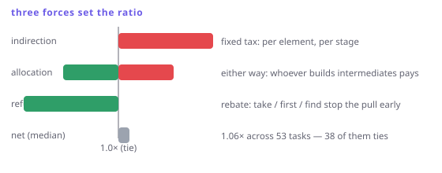

# What the abstractions cost

> **In this chapter**
> - the measured shape of the trade, across 53 real tasks
> - the two mechanisms that make a pipeline slower, and the one that makes it faster
> - why "allocations" is the answer to almost every performance question here
> - how to decide, for your code, without trusting anyone's ratio

## The numbers

FxDart ships a benchmark suite that compares each of its 53 side-by-side
examples against a hand-written Dart version of the same task, AOT-compiled,
median of repeated runs. At the largest scale of each case:

| Outcome at the headline scale | Cases |
|---|---|
| Tie (within 5% or 0.6ms) | 38 |
| Hand-written Dart faster | 12 |
| FxDart faster | 3 |

Median ratio across all 53: **1.06×** — the pipeline is about six percent
slower, typically, and inside the noise band more often than not.

The extremes are more interesting than the median:

| Case | Ratio | What it means |
|---|---|---|
| `top-expenses` | **0.27×** | pipeline nearly 4× *faster* |
| `price-drop-detection` | 0.52× | pipeline 2× faster |
| `smoothed-zone-changes` | 2.23× | pipeline 2.2× slower |
| `anomaly-context` | 1.76× | pipeline 1.8× slower |

Same library, same machine, an eight-fold spread between best and worst. Any
sentence of the form "FP is *n* times slower in Dart" is therefore false; the
number depends entirely on which of three mechanisms dominates.

## Mechanism 1 — per-element indirection (costs you)

A hand-written loop reads an element and applies your code inline. A pipeline
sends every element through an iterator per stage: a virtual `moveNext`, a
`current` getter, a closure call. Dart's AOT compiler inlines a lot of that,
but not across a polymorphic iterator boundary, and the cost is paid *per
element per stage*.

That is why the losers above are the chapters with many cheap stages over
uniform data: windowed smoothing, adjacent comparisons, small numeric work. The
per-element overhead is fixed, the useful work per element is tiny, so the
ratio is bad.

```dart run
import 'package:fxdart/fxdart.dart';

void main() {
  final data = List.generate(200000, (i) => i);
  final sw = Stopwatch()..start();

  var loop = 0;
  for (final n in data) {
    if (n.isEven) loop += n * 2;
  }
  final loopMs = sw.elapsedMicroseconds;

  sw.reset();
  final piped =
      fx(data).filter((n) => n.isEven).map((n) => n * 2).sum();
  final pipeMs = sw.elapsedMicroseconds;

  print([loop, piped, loop == piped]);
  print('loop ${loopMs}us, pipeline ${pipeMs}us');
  // In the browser this is JIT-compiled JS, so treat the ratio
  // as indicative; the book's table is AOT.
}
```

## Mechanism 2 — allocation (costs both, differently)

Most large differences in the suite are not CPU, they are garbage. The
hand-written version of a grouping task builds intermediate `List`s and `Map`s;
the pipeline version may build none, or may build a record per element. Which
side allocates more depends on the task, and allocation dominates the timing
whenever it differs.

This is the single most useful diagnostic: *count the allocations on both
sides.* If they are equal, the two versions will be within noise of each other.
If one side materialises an intermediate collection the other never builds, that
side loses regardless of how tight its loop is.

## Mechanism 3 — work refused (pays you)

Chapter 11's cost model, showing up on the scoreboard. `top-expenses` is 3.7×
faster in the pipeline version not because the pipeline is quick, but because
it never sorts the whole list: it takes what it needs and stops, while the
native version sorts 10,000 elements to read the top five.

Every one of the three FxDart wins is this mechanism. When a task has the shape
"most of this data does not matter", laziness beats a faster loop that does all
the work anyway.



*Figure 14-1. Three independent forces. Indirection is a fixed tax per element per stage; allocation is whichever side builds more intermediates; refused work is the pipeline's rebate when a terminal stops early.*

## The measurement rules that keep this honest

The suite's own rules, worth copying:

- **AOT, not JIT.** JIT numbers flatter whichever side warms up better.
- **Median of repeated runs in a fresh process**, not a single timing.
- **A tie band** — 5% or 0.6ms — because a difference a user cannot perceive is
  not a difference. Two-thirds of the cases land in it.
- **Report memory too.** Peak RSS is where an intermediate list shows up, and
  it is the number that decides whether a job fits on a small container.
- **Never benchmark a claim you have not run twice.** Cross-run noise on a
  quiet machine is around 5%, so any single-digit percentage difference from
  one run is a coin flip.

> 🎓 **Big-O is unchanged; constants are not.** None of this affects asymptotic
> complexity: a lazy `filter` + `map` + `fold` is O(n) exactly like the loop,
> and `top-expenses` is faster because laziness changes the *algorithm*
> (partial selection instead of a full sort), not because the constant improved.
> When you find a large win, ask which one it was — a constant-factor win of
> 30% is a tuning result, an asymptotic win is a design result, and only the
> second one survives a change of input size.

## How to decide for your own code

1. **Assume a tie.** Two-thirds of real tasks are one, and readability is then
   the only remaining criterion.
2. **Look for refused work.** Any `take`, `first`, `find`, or early-exiting
   `any` over a large source is a reason to expect the pipeline to win.
3. **Look for intermediates.** Count them on both sides; the side with more
   loses.
4. **Measure the actual case, twice.** With a tie band, in AOT, at the size
   your program really sees.
5. **Then choose.** A 6% median cost is a fair price for code your team can
   read — and it is not a price you should pay in the inner loop of a frame
   renderer.

## When to reach for the loop

Write the `for` loop when the code is in a hot path, the stages are cheap, and
the source is fully consumed — that is precisely the losing shape. Write it too
when the operation genuinely is imperative: mutating a buffer, filling a
pre-sized list, driving an index-based algorithm. Chapter 22 collects the rest
of these cases; this chapter's contribution is that you can now *predict* the
answer instead of guessing, and check it in ten minutes.

## Exercises

1. A pipeline has five stages over 1M elements and finishes with `.first`. Which
   of the three mechanisms dominates, and what is the expected ratio against a
   loop that does the same job?
2. Why is peak RSS often a better discriminator than elapsed time when
   comparing two versions of a grouping task?
3. The suite calls a difference under 5% a tie. Construct a case where a 4%
   difference genuinely matters, and say what you would have to change about
   the measurement to detect it reliably.
4. `smoothed-zone-changes` is 2.2× slower as a pipeline. Before looking at it,
   predict which two features of the task cause that, based on this chapter.

## Solutions

1. Refused work dominates. `.first` pulls one element through five stages, so
   the pipeline does roughly five closure calls of work while the loop version —
   if written naively — processes the whole list. The expected ratio is
   enormous and in the pipeline's favour; if the loop also breaks early, the
   two converge to a tie plus the pipeline's fixed per-stage overhead.
2. Because grouping is where intermediates hide. Both versions may take the same
   time on a warm machine with plenty of RAM, while one holds every group in
   memory at once and the other streams; RSS shows that difference immediately
   and predicts which one falls over on a larger input.
3. A tight render loop at 120fps has an 8.3ms budget, so 4% of a 5ms frame is a
   third of a millisecond of headroom — real. To detect it you need many more
   iterations per measurement (to lift the signal above timer resolution), a
   quiet machine, and paired interleaved A/B runs rather than one-after-another
   runs, so that drift affects both sides equally.
4. Many cheap stages (a sliding window plus a comparison plus a map) over
   uniform numeric data, with everything consumed — no stage refuses work, and
   per-element indirection is paid several times per element with very little
   real computation to amortise it against.
