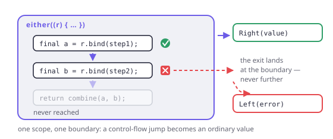

# The Raise scope

> **In this chapter**
> - the mechanism: what `r.bind` actually does when it fails
> - delimited continuations versus monadic desugaring, and why Dart forced the choice
> - the leak rule — the one way to misuse a scope, and how the library catches it
> - what you gain and lose against `flatMap` chains

## What `either` is

Chapter 7 used the scope and did not open it. Here is the shape:

```dart run
import 'package:fxdart/fxdart.dart';

Either<String, int> half(int n) => n.isEven
    ? Either.right(n ~/ 2)
    : Either.left('odd: $n');

void main() {
  final result = either<String, int>((r) {
    final a = r.bind(half(20)); // 10
    final b = r.bind(half(a)); // 5
    final c = r.bind(half(b)); // odd → exits here
    return c * 100; // never reached
  });

  print(result);
}
```

`either` runs your block with a `Raise<E>` object. `r.bind` looks at an
`Either`: on a `Right` it returns the value, on a `Left` it **abandons the
block entirely** and makes `either` return that `Left`. No pyramid, no
`flatMap`, and the block reads top to bottom.

The mechanism is a control-flow escape: `raise` throws a private marker that
`either` catches at the boundary and converts into a `Left`. Because the throw
and the catch are both inside the library, the escape is *delimited* — it can
only ever travel as far as the enclosing `either`, and no further.



*Figure 15-1. Every `bind` is a possible exit, and every exit lands at the same place: the boundary of the scope that created `r`. That boundary is what turns a control-flow jump back into an ordinary value.*

## Delimited continuation, not desugaring

Scala's `for` and Haskell's `do` are **rewrites**: the compiler turns the block
into `flatMap` calls before it type-checks. That works for any monad, and needs
higher-kinded types to say "any monad" — which Chapter 10 explained Dart does
not have.

FxDart's scope is not a rewrite. Nothing is transformed; a real object is
passed in, and control leaves the block by a mechanism the language already
has. The trade is exact:

| | Desugaring (`do`, `for`) | Scope (`either`, Arrow's `Raise`) |
|---|---|---|
| Works for | any monad the types can name | the effects the library wrote |
| Needs | higher-kinded types | nothing special |
| Failure exit | returning a short-circuited value | non-local jump, caught at the boundary |
| Composes with `async` | needs a transformer | naturally — `eitherAsync` |
| Extensible by you | yes, by defining a monad | no |

The last two rows are the reason the choice is defensible rather than merely
forced. A transformer tower (`EitherT[Future, E, A]`) is the general answer,
and it is genuinely hard to read; the scope handles the one combination people
actually write — failure inside async — with no new type at all:

```dart run
import 'package:fxdart/fxdart.dart';

Future<Either<String, int>> lookup(String key) async {
  await Future.delayed(const Duration(milliseconds: 10));
  return key == 'port'
      ? Either.right(8080)
      : Either.left('missing: $key');
}

void main() async {
  final ok = await eitherAsync<String, String>((r) async {
    final port = r.bind(await lookup('port'));
    final host = r.bind(await lookup('port'));
    return 'http://$host:$port';
  });
  print(ok);

  final bad = await eitherAsync<String, String>((r) async {
    final port = r.bind(await lookup('nope'));
    return 'never: $port';
  });
  print(bad);
}
```

`await` sequences time, `r.bind` sequences failure, and the two are unaware of
each other. That is the whole payoff.

## The three scope flavours

FxDart ships a scope per failure representation, because — Chapter 10 again —
there is no way to write one that covers them all:

```dart run
import 'package:fxdart/fxdart.dart';

int? parseTeen(String s) {
  final n = int.tryParse(s);
  return (n != null && n >= 13 && n <= 19) ? n : null;
}

void main() {
  // Failure as a typed value.
  print(either<String, int>((r) {
    final n = r.ensureNotNull(
        parseTeen('15'), () => 'not a teen');
    return n * 2;
  }));

  // Failure as null — no error value to carry.
  print(nullable((r) {
    final n = r.bind(parseTeen('15'));
    return n * 2;
  }));
  print(nullable((r) {
    final n = r.bind(parseTeen('42'));
    return n * 2;
  }));

  // Failure as a thrown exception, handled at the boundary.
  print(catching<int>(() => int.parse('nope'), (e, _) => -1));

  // …or converted straight into a Left.
  print(eitherCatching<String, int>(
      (r) => int.parse('nope'), (e, _) => 'not a number'));
}
```

Three scopes, one idea: run straight-line code, exit at the first failure,
convert the exit into whatever the caller's type says.

## The leak rule

There is exactly one way to misuse a scope, and it follows from the mechanism:
**`r` may only be used while its scope is running.** Capture it in a closure
that outlives the block, and its escape has nowhere to land.

```dart run
import 'package:fxdart/fxdart.dart';

void main() {
  late Raise<String> escaped;

  final result = either<String, int>((r) {
    escaped = r; // capturing the scope object…
    return 1;
  });
  print(result);

  try {
    escaped.raise('too late'); // …and using it after it closed
  } catch (e) {
    print('caught: ${e.runtimeType}');
  }
}
```

The library detects it and throws `RaiseLeakedError` rather than letting a
stray control-flow jump escape into unrelated code. In practice the rule bites
in one place: **do not use `r` inside a callback that runs later** — an
unawaited future, a timer, a stream listener. Inside `eitherAsync`, stay on the
awaited chain; that is the same rule stated for async.

> 🎓 **This is an old idea with a new name.** A delimited continuation captures
> "the rest of the computation up to a boundary" and lets you abandon or resume
> it; `shift`/`reset` in Scheme, `Cont` in Haskell, algebraic effect handlers in
> OCaml 5 and Koka are all this machinery. `Raise` uses only the abandoning
> half, which is why it can be implemented with a private exception rather than
> a real capture of the stack. That restriction is also what makes it cheap and
> predictable: no re-entry, no resumption, no surprising re-execution — one
> exit, one boundary, one value.

## When this earns its keep

Three or more fallible steps that share an error type, especially with early
returns and guard conditions in between — `r.ensure(cond, () => err)` replaces
the `if (!cond) return Left(...)` that a `flatMap` chain cannot express without
another nesting level.

It is the wrong tool for independent validations (Chapter 6 — you want
accumulation), for a single fallible call (return the `Either` directly), and
anywhere the block hands `r` to code that will run later, which the leak rule
forbids.

## Exercises

1. Rewrite the first listing as a `flatMap` chain. Which version makes it
   easier to add a guard — "fail if the value drops below 3" — between steps?
2. What does `either` return when the block throws a genuine exception rather
   than raising? Try it, and explain why that is the right default.
3. Why can a scope not be resumed — that is, why is there no `r.recover(...)`
   that continues the block after a failure? Answer in terms of the mechanism.
4. `nullable` has no error value at all. What is its `E` type, and what does
   that tell you about the relationship between `Either<E, A>` and `A?`?

## Solutions

1. The chain is `half(20).flatMap(half).flatMap(half).map((c) => c * 100)`.
   Adding a guard means inserting a `flatMap((v) => v < 3 ? Left(...) :
   Right(v))` — a new nesting level and a new lambda — where the scope version
   adds one line: `r.ensure(a >= 3, () => 'too small')`. Guards are where the
   scope pulls ahead decisively.
2. The exception propagates out of `either` unchanged. That is right because a
   thrown exception means "something happened that this error type does not
   describe" — silently converting it into a `Left` would launder a bug into a
   domain failure. `eitherCatching` exists for when you *do* want the
   conversion, and it is a separate function precisely so the choice is
   explicit. Chapter 18 develops this boundary.
3. Because the escape is implemented as a throw: by the time `either` sees the
   failure, the block's stack frames are already unwound and its local
   variables are gone. Resuming would require capturing the continuation before
   unwinding, which is the half of delimited continuations `Raise` deliberately
   does not implement. Recovery therefore happens *outside*, on the returned
   `Either` — `result.fold(...)` or `getOrElse`.
4. Its `E` is effectively `void`/`Null` — there is nothing to carry.
   `A?` is `Either<Unit, A>` with the failure side carrying no information, so
   every nullable computation is an `Either` that has forgotten why it failed.
   That is the trade Chapter 18 examines: nullability is free and mute, typed
   errors cost a type parameter and can tell you what went wrong.
