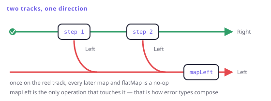

# Either as a railway

> **In this chapter**
> - the two-track picture, and which operations move between tracks
> - mapping the failure side, and why error types need it to compose
> - recovery: `fold`, `getOrElse`, and where a program stops being total
> - `Either` inside a pipeline — `sequence`, `separate`, and the shape of a real import

## Two tracks

Draw a success track and a failure track running side by side. Every fallible
step is a switch: it either continues along the success track or diverts, once,
onto the failure track — where it stays.



*Figure 16-1. `map` runs only on the green track. `flatMap` is the switch. `mapLeft` is the only thing that touches the red track, and nothing rejoins without an explicit `fold`.*

That picture is the whole semantics:

| Operation | Green track (`Right`) | Red track (`Left`) |
|---|---|---|
| `map(f)` | applies `f` | passes through |
| `flatMap(f)` | applies `f`, which may divert | passes through |
| `mapLeft(g)` | passes through | applies `g` |
| `fold(l, r)` | applies `r` | applies `l` |

```dart run
import 'package:fxdart/fxdart.dart';

Either<String, int> parseQty(String s) {
  final n = int.tryParse(s);
  return n == null
      ? Either.left('not a number')
      : Either.right(n);
}

void main() {
  final ok = parseQty('12');
  final bad = parseQty('twelve');

  print([ok.map((n) => n * 2), bad.map((n) => n * 2)]);
  print(ok.mapLeft((e) => 'qty: $e'));
  print(bad.mapLeft((e) => 'qty: $e'));
  print(bad.fold((e) => 'failed — $e', (n) => 'got $n'));
}
```

Once on the red track a value is inert: every subsequent `map` and `flatMap` is
a no-op. That is short-circuiting, and it needs no special support anywhere
downstream — which is why you can add a step to the middle of a chain without
touching the rest.

## Error types have to compose too

Two steps with different error types do not chain, and this is where real code
usually stalls:

```dart run
import 'package:fxdart/fxdart.dart';

class ParseError {
  const ParseError(this.input);
  final String input;
  @override
  String toString() => 'ParseError($input)';
}

class RangeError2 {
  const RangeError2(this.value);
  final int value;
  @override
  String toString() => 'RangeError2($value)';
}

// A common error type for the pipeline to speak.
sealed class OrderError {
  const OrderError();
}

class BadInput extends OrderError {
  const BadInput(this.detail);
  final String detail;
  @override
  String toString() => 'BadInput($detail)';
}

Either<ParseError, int> parse(String s) {
  final n = int.tryParse(s);
  return n == null ? Either.left(ParseError(s)) : Either.right(n);
}

Either<RangeError2, int> inStock(int n) =>
    n <= 5 ? Either.right(n) : Either.left(RangeError2(n));

void main() {
  // mapLeft lifts both into the pipeline's own error type.
  Either<OrderError, int> order(String raw) => either((r) {
        final n = r.bind(
            parse(raw).mapLeft((e) => BadInput('$e')));
        final ok = r.bind(
            inStock(n).mapLeft((e) => BadInput('$e')));
        return ok;
      });

  print(order('3'));
  print(order('nine'));
  print(order('9'));
}
```

`mapLeft` is what makes a failure type *local*: each module can raise the error
it knows about, and the caller translates at the boundary. Without it you end
up with one god-enum of every error in the program, which is the typed-error
equivalent of catching `Exception`.

A `sealed` error type (Chapter 3) pays off here: `switch` over `OrderError` at
the top of the program is exhaustive, so adding a case is a compile error at
every handler.

## Recovery, and where totality ends

A railway is only useful if the tracks eventually merge back into something the
caller can use. That merge is `fold`, and it is the point where you must decide
what the failure *means*:

```dart run
import 'package:fxdart/fxdart.dart';

Either<String, int> configPort(String? raw) => raw == null
    ? Either.left('missing')
    : (int.tryParse(raw) == null
        ? Either.left('not a number: $raw')
        : Either.right(int.parse(raw)));

void main() {
  // Substitute a default — the failure was recoverable.
  print(configPort(null).fold((_) => 8080, (n) => n));

  // Keep the reason and report it — the failure was not.
  print(configPort('x')
      .fold((e) => 'config error: $e', (n) => '$n'));

  // Switch on it, exhaustively, when the type is sealed.
  final result = configPort('9000');
  final message = switch (result) {
    Left(:final value) => 'no port ($value)',
    Right(:final value) => 'port $value',
  };
  print(message);
}
```

Three endings, one rule: **the program becomes total again at the `fold`.**
Before it, a failure is data flowing along a track; after it, a decision has
been made. Pushing that point as late as possible — to the HTTP handler, the
UI, the CLI's exit code — is the single most useful habit this chapter has.

## Either in a pipeline

Real work has many rows, and Chapter 9's traversals are how the railway scales
past one value:

```dart run
import 'package:fxdart/fxdart.dart';

Either<String, int> parseRow(String s) {
  final n = int.tryParse(s);
  return n == null ? Either.left('bad row: $s') : Either.right(n);
}

void main() {
  final rows = ['10', 'x', '30', 'y'];

  // All or nothing.
  print(fx(rows).map(parseRow).sequence());

  // Everything that failed, and everything that did not.
  final (errors, values) = separateEither(rows.map(parseRow));
  print('imported ${values.length}, rejected: $errors');

  // Keep going, but report every reason at the end.
  print(fx(rows).map(parseRow).flattenOrAccumulate());
}
```

Three policies, one parser. That separation — the per-row function knows
nothing about the policy, the pipeline chooses it — is what the two-track shape
buys at scale.

> 🎓 **Railway-oriented programming, and where the metaphor leaks.** Scott
> Wlaschin's "railway-oriented programming" talk is where most people meet this
> picture, and it is a good one — but it describes `Either` used *monadically*,
> which is only half the story. The picture has no way to draw two trains that
> both crashed (Chapter 6's accumulation), and it suggests failures are rare
> derailments when in most systems they are ordinary outcomes with their own
> logic. Keep the picture for sequencing and drop it when you need to combine
> independent results.

## When this earns its keep

Domain failures the caller can act on: validation, parsing, authorisation,
business rules, anything you would otherwise express as a nullable return plus
a comment. It pays most where failures must carry *information* — which rule,
which field, which id.

It does not pay for failures nobody can act on (out of memory, a bug), for a
single call whose only failure mode is "not found" (`A?` is smaller), or for
error types you cannot name yet — an `Either<String, T>` where the string is
built by interpolation is a stringly-typed exception with extra steps.

## Exercises

1. `map` on a `Left` does nothing. Which functor law forces that, and what
   would break if a library "helpfully" ran the function anyway?
2. Write `getOrElse` for `Either` in terms of `fold`. Then write `orElse`,
   which takes a fallback `Either` rather than a fallback value.
3. You have `Either<A, T>` from one module and `Either<B, T>` from another, and
   the caller wants `Either<C, T>`. Sketch the three `mapLeft` calls and say
   where in a layered application they belong.
4. `separateEither` returns `(errors, values)`. Why that order, and what
   consequence does the choice have for reading code at a glance?

## Solutions

1. The identity law: `left.map(id)` must equal `left`. If `map` ran `f` on the
   failure value it would have to put the result somewhere — changing the
   `Left`'s type or its content — so mapping identity would no longer be a
   no-op. What breaks concretely is composition: `map(f).map(g)` would apply
   both functions to an error that neither was written for, usually crashing
   inside code that assumed a success value.
2. `T getOrElse<T>(Either<Object?, T> e, T fallback) =>
   e.fold((_) => fallback, (v) => v);` and
   `Either<E, T> orElse<E, T>(Either<E, T> e, Either<E, T> other) =>
   e.fold((_) => other, (_) => e);`. The second one is the semigroup on
   `Either` that keeps the first success — a monoid if you have an identity
   failure, which you usually do not.
3. `moduleA().mapLeft(toC)` and `moduleB().mapLeft(toC)`, both at the seam
   where the two modules meet — typically the use-case or service layer, not
   inside either module and not at the HTTP boundary. Translating too early
   couples the module to the caller's vocabulary; too late means the god-enum.
4. It matches `(Left, Right)` — the same order as the type parameters and as
   the `switch` arms, so nothing in the codebase ever asks "which one is
   first". Consistency here is worth more than any argument about which is more
   important: a reader who has to check the order once will have to check it
   every time.
