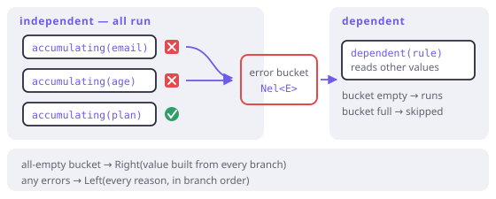

# Accumulating failure

> **In this chapter**
> - the product question that decides fail-fast versus fail-slow
> - the four tools, and which one fits which shape of validation
> - independent and dependent rules, and why mixing them wrongly is the classic bug
> - a complete form validation, from raw strings to a domain type

## The product question

Chapter 6 established that only the applicative shape *can* accumulate. This
chapter is about when it *should*, and the test has nothing to do with types:

> Will a human read these errors and fix them in one pass?

If yes — a form, a config file, an import, an API request body — collect them
all. Telling someone their postcode is wrong, waiting for a round trip, and
then telling them their phone number is wrong is a bad product, not a bad
program.

If no — a chain of internal steps, an authorisation check, anything where the
second failure is a *consequence* of the first — fail fast. Ten cascading
errors from one root cause is noise, and it hides the one that mattered.

## The four tools

```dart run
import 'package:fxdart/fxdart.dart';

Either<String, int> parseAge(String s) {
  final n = int.tryParse(s);
  return n == null
      ? Either.left('age: not a number')
      : Either.right(n);
}

void main() {
  final raw = ['31', 'x', '44', 'y'];

  // 1. zipOrAccumulate2..5 — a fixed set of independent branches.
  print(either<Nel<String>, String>((r) => r.zipOrAccumulate2(
        (br) {
          if (raw[1] != '0') br.raise('second must be 0');
          return raw[1];
        },
        (br) {
          if (raw[3] != '0') br.raise('fourth must be 0');
          return raw[3];
        },
        (a, b) => '$a/$b',
      )));

  // 2. mapOrAccumulate — the same rule over many items.
  print(mapOrAccumulate(
      (r, String s) => r.bind(parseAge(s)), raw));

  // 3. flattenOrAccumulate — you already have the Eithers.
  print(fx(raw).map(parseAge).flattenOrAccumulate());

  // 4. accumulate — the general scope, any number of branches,
  //    and the only one that supports dependent rules.
  print(either<Nel<String>, int>((r) => r.accumulate((acc) {
        final first = acc.accumulating(
            (br) => br.bind(parseAge(raw[0])));
        final third = acc.accumulating(
            (br) => br.bind(parseAge(raw[2])));
        return first.value + third.value;
      })));
}
```

Choosing between them is mechanical:

| Shape | Tool |
|---|---|
| 2–5 named, independent fields | `zipOrAccumulate2..5` |
| One rule, many items | `mapOrAccumulate` |
| Already have `Either`s | `flattenOrAccumulate` / `.flattenOrAccumulate()` |
| More than five branches, or dependent rules | `accumulate` |

## Independent, then dependent

The rule that makes accumulation correct is Chapter 6's distinction, and it has
a precise API shape:

- `acc.accumulating(...)` — an **independent** branch. It always runs; its
  failures are recorded rather than propagated.
- `acc.dependent(...)` — a **dependent** rule. It runs only when nothing has
  failed yet, because it reads another branch's value.

Reading an `Accumulated.value` from a branch that failed detonates on purpose:
it raises the whole accumulated list at once. That is what makes the final
`return` safe — by the time you combine values, either all branches succeeded
or you never get there.



*Figure 17-1. Independent branches all run and drop their failures into one bucket. Dependent rules are downstream of that bucket: they run only if it is empty, because they read values that might not exist.*

## A form, end to end

```dart run
import 'package:fxdart/fxdart.dart';

class Signup {
  const Signup(this.email, this.age, this.plan);
  final String email;
  final int age;
  final String plan;

  @override
  String toString() => 'Signup($email, $age, $plan)';
}

Either<Nel<String>, Signup> validate(Map<String, String> form) =>
    either((r) => r.accumulate((acc) {
          final email = acc.accumulating((br) {
            final v = form['email'] ?? '';
            if (!v.contains('@')) {
              br.raise('email: must contain @');
            }
            return v;
          });

          final age = acc.accumulating((br) {
            final n = int.tryParse(form['age'] ?? '');
            if (n == null) br.raise('age: not a number');
            if (n != null && n < 18) br.raise('age: must be 18+');
            return n ?? 0;
          });

          final plan = acc.accumulating((br) {
            final v = form['plan'] ?? '';
            if (v != 'free' && v != 'pro') {
              br.raise('plan: unknown "$v"');
            }
            return v;
          });

          // Dependent: only meaningful once age and plan parsed.
          acc.dependent((br) {
            if (plan.value == 'pro' && age.value < 21) {
              br.raise('plan: pro requires 21+');
            }
            return null;
          });

          return Signup(email.value, age.value, plan.value);
        }));

void main() {
  print(validate(
      {'email': 'a@b.co', 'age': '30', 'plan': 'pro'}));
  print(validate(
      {'email': 'nope', 'age': 'x', 'plan': 'gold'}));
  print(validate(
      {'email': 'a@b.co', 'age': '19', 'plan': 'pro'}));
}
```

Three shapes of answer from one function: a value, every independent problem at
once, and a dependent rule that only speaks when the values it needs exist.

Note the second case reports *three* errors from three fields, and the third
reports one — the dependent rule — because the independent branches all passed.
That is the behaviour a user expects and the reason this machinery exists.

## The rules that keep it honest

1. **One branch per independent concern.** A branch that validates two fields
   cannot report on the second if the first failed.
2. **Raise more than once in a branch when it makes sense.** A branch may
   contribute several errors; `age` above raises up to two.
3. **Never read `.value` inside an independent branch.** That is what
   `dependent` is for, and reading early detonates the whole scope.
4. **Order the errors the way the user reads the form.** Branch order is
   report order, and it is free to get right.
5. **Do not accumulate consequences.** If step B is meaningless when A failed,
   B belongs in `dependent` or in a fail-fast scope, not in a branch.

> 🎓 **Why there is no `Validated` type.** Arrow 1.x had one — a separate
> `Validated<E, A>` whose applicative accumulated and which you converted to and
> from `Either` at every boundary. Arrow 2.x deleted it, and FxDart never had
> it: the same effect is available as a *scope* over `Either<Nel<E>, A>`, which
> means one result type in your domain signatures instead of two, and no
> `toEither()` calls scattered through the code. The theory lost nothing —
> `Validated` was only ever `Either` with a different applicative instance, and
> since Dart cannot select instances by type anyway (Chapter 10), naming the
> behaviour at the call site is strictly more honest.

## When this earns its keep

User-facing input of any kind; batch imports where a partial report saves
another run; configuration, where every missing key should be reported before
the process exits; API payloads, where a 400 that lists all violations is worth
five that list one each.

It costs where failures are cheap to re-discover (a fast local retry), where
the errors are for machines rather than humans (one code is enough), and where
running every branch is expensive — accumulation means *no* short-circuiting,
so five slow independent checks all run even when the first has already failed.

## Exercises

1. In the signup form, move the "pro requires 21+" rule from `dependent` to
   `accumulating` and predict the output for `{'age': 'x', 'plan': 'pro'}`.
2. `mapOrAccumulate` over 10,000 rows collects every failure. What is the
   memory shape of that, and what would you do differently for a 10M-row
   import?
3. Why is the error type `Nel<String>` and not `List<String>`? Give the state
   that `List` admits and `Nel` forbids.
4. A branch calls an API. Should it be `accumulating` or `dependent`, and what
   changes if two branches call the same API?

## Solutions

1. It would run, read `age.value` from a failed branch, and detonate — raising
   the accumulated errors from inside the branch rather than at the end of the
   scope. The output is still a `Left` with the parse error, but the mechanism
   is an early exit rather than a clean accumulation, and a rule that needed to
   run after it would be skipped. `dependent` exists to make this impossible by
   construction.
2. Every failure is retained until the end, so worst case you hold 10,000 error
   strings — fine. At 10M rows it is not: you would stream and report, capping
   the collected errors (the first N, plus a count) or writing them to a
   rejects file as they occur. Accumulation is bounded by the failure count,
   and that is the number to sanity-check before choosing it.
3. `List<String>` admits `Left([])` — "this failed, and there are no reasons" —
   which is unrepresentable nonsense of exactly the kind Chapter 3 is about.
   `Nel` makes the guarantee structural: a failure always carries at least one
   reason, so no consumer needs a "no errors?" branch.
4. `accumulating`, if the call is independent — you want its failure reported
   alongside the others. If two branches call the same API, they run
   sequentially inside the scope and you pay twice; hoist the call above the
   scope, pass the result in, and keep the branches pure. That also makes the
   validation testable without a network, which is Chapter 2's argument arriving
   again from a different direction.
