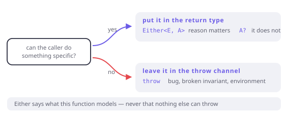

# The honest boundary

> **In this chapter**
> - Dart's three failure channels, and what each one can and cannot say
> - the rule for choosing: can the caller do something about it?
> - why `Either` never makes a program exception-free, and why that is fine
> - converting at the edges, in both directions

## Three channels

Dart lets a function fail in three ways, and they are not interchangeable.

| Channel | Type says | Caller must | Carries |
|---|---|---|---|
| `throw` | nothing | nothing (unchecked) | any object + stack trace |
| `A?` | it might be absent | handle null | no reason |
| `Either<E, A>` | it might fail, with `E` | handle both sides | a typed reason |

Each is right for something:

```dart run
import 'package:fxdart/fxdart.dart';

// 1. Nullable: absence is the whole story.
int? findIndexOf(List<String> xs, String needle) {
  final i = xs.indexOf(needle);
  return i == -1 ? null : i;
}

// 2. Either: the caller needs to know *why*.
Either<String, int> parsePort(String s) {
  final n = int.tryParse(s);
  if (n == null) return Either.left('not a number: $s');
  if (n < 1024) return Either.left('privileged: $n');
  return Either.right(n);
}

// 3. Throw: the caller cannot act, and the program is broken.
int divide(int a, int b) {
  if (b == 0) throw ArgumentError('b must not be zero');
  return a ~/ b;
}

void main() {
  print(findIndexOf(['a', 'b'], 'z'));
  print(parsePort('80'));
  try {
    divide(1, 0);
  } catch (e) {
    print('threw: $e');
  }
}
```

The choice rule is one question: **can the caller do something specific about
this failure?** If yes, it belongs in the type — `Either` if the reason matters,
`A?` if it does not. If no, throw: a bug, a broken invariant, or an environment
failure nobody can recover from at that call site.



*Figure 18-1. The question is not how bad the failure is, it is whether the caller has a reaction. Everything the caller can act on belongs in the return type; everything else belongs in the exception channel, where it will not clutter every signature between here and the top.*

## What typed errors cannot promise

Here is the uncomfortable part, and the reason this chapter exists.

`Either<E, A>` in the signature does *not* mean "this function only fails with
`E`". Dart has unchecked exceptions, so any code — yours, the SDK's, a
dependency's — may throw at any time. An `Either`-returning function can still
blow up with `StateError`, `RangeError`, `OutOfMemoryError`, or a bug in a
transitive package.

So the honest statement is narrower, and it is still worth a lot:

> `Either<E, A>` says: *the failures this function models are `E`, and they are
> in the type.* It says nothing about failures nobody modelled.

Compare with a checked-exception language, which promises the full set and pays
for it with `throws` clauses on everything. Dart chose unchecked; a library
cannot un-choose it. What FxDart adds is a channel for the failures you *did*
think about, which is where the bugs actually come from.

```dart run
import 'package:fxdart/fxdart.dart';

Either<String, int> risky(String s) => either((r) {
      if (s.isEmpty) r.raise('empty');
      // Not modelled, and not caught by the signature:
      return int.parse(s); // throws on 'abc'
    });

void main() {
  print(risky(''));
  try {
    print(risky('abc'));
  } catch (e) {
    print('escaped the Either: ${e.runtimeType}');
  }

  // If you want throws folded into the failure channel, say so.
  print(eitherCatching<String, int>(
      (r) => int.parse('abc'), (e, _) => 'not a number'));
}
```

`eitherCatching` is the explicit conversion, and it being explicit is the
design: silently swallowing every throw would turn genuine bugs into domain
failures, and you would find out in production, one `Left('Bad state: no
element')` at a time.

## Converting at the edges

A program has a boundary where the outside world's failure style meets yours.
Both directions are one line, and both belong at that boundary, not scattered:

```dart run
import 'package:fxdart/fxdart.dart';

class Config {
  const Config(this.port);
  final int port;
  @override
  String toString() => 'Config($port)';
}

// Inbound: a throwing API becomes a typed failure.
Either<String, Config> loadConfig(Map<String, String> env) =>
    eitherCatching(
      (r) {
        final raw = env['PORT'];
        r.ensureNotNull(raw, () => 'PORT is not set');
        return Config(int.parse(raw!));
      },
      (e, _) => 'PORT is not a number',
    );

// Outbound: a typed failure becomes the framework's exception.
Config loadOrThrow(Map<String, String> env) =>
    loadConfig(env).fold(
      (e) => throw StateError('bad config: $e'),
      (c) => c,
    );

void main() {
  print(loadConfig({'PORT': '8080'}));
  print(loadConfig({}));
  print(loadConfig({'PORT': 'abc'}));

  try {
    loadOrThrow({});
  } catch (e) {
    print('at the edge: $e');
  }
}
```

Inbound conversion happens where you call code you do not control. Outbound
conversion happens where a framework demands a throw — a Flutter build method,
a test helper, `main`. In between, failures are values.

> 🎓 **Errors versus exceptions, and what Dart's own SDK means.** Dart's
> convention is that `Error` (`ArgumentError`, `StateError`,
> `RangeError`) signals a *programming mistake* — the caller violated a
> contract and should be fixed, not handled — while `Exception` signals a
> condition a correct program may still hit (`FormatException`,
> `IOException`). That maps neatly onto this chapter: `Error` should never be
> caught and converted into a `Left`, because doing so hides a bug;
> `Exception` is a fine candidate for `eitherCatching`. When you write a
> library, following the convention is what lets your callers make this
> distinction at all.

## The nullable middle ground

`A?` is the cheapest failure channel Dart has, and it is genuinely the right
answer more often than typed-error enthusiasts admit — with one test: *is
"absent" the entire message?* A map lookup, a first-match search, an optional
field: yes. A parse, a validation, an authorisation: no, because the caller
will want to say what went wrong.

FxDart's `nullable` scope exists so the null-shaped chain gets the same
straight-line treatment:

```dart run
import 'package:fxdart/fxdart.dart';

class User {
  const User(this.name, this.managerId);
  final String name;
  final String? managerId;
}

final users = <String, User>{
  'u1': User('Ada', 'u2'),
  'u2': User('Grace', null),
};

String? managerName(String id) => nullable((r) {
      final user = r.bind(users[id]);
      final managerId = r.bind(user.managerId);
      final manager = r.bind(users[managerId]);
      return manager.name;
    });

void main() {
  print(managerName('u1'));
  print(managerName('u2')); // no manager
  print(managerName('u9')); // no such user
}
```

Three ways to be absent, one `null` out, and no pyramid of `?.` and `??`. Note
what is missing from the output: which of the three it was. That is the exact
information `Either` costs a type parameter to keep.

## When this earns its keep

The rules in this chapter pay every time a new function is written, which makes
them the highest-frequency decision in the book. Getting them right keeps
signatures honest and keeps `try` blocks rare and meaningful.

They stop paying if applied dogmatically: an `Either<String, T>` on every
private helper adds noise without adding information, and a codebase where
`main` is the only `try` is a codebase that will drop a stack trace someone
needed. Convert at boundaries, model what callers can act on, and let genuine
bugs crash loudly.

## Exercises

1. Classify these as throw / `A?` / `Either`: JSON that fails to parse; a
   missing optional query parameter; a negative array length passed to your
   own function; a payment declined by the provider.
2. `int.parse` throws and `int.tryParse` returns null. Which channel would
   `Either` have given, and what would it have had to invent?
3. Why is `eitherCatching` a separate function rather than the default
   behaviour of `either`? Describe the bug that would follow from the other
   choice.
4. A function returns `Either<E, A>` but also throws on some inputs. How would
   you discover that, and what would you change — the code or the signature?

## Solutions

1. JSON parse failure: `Either` if a user can fix the input, `A?` if the caller
   only branches on validity. Missing optional parameter: `A?` — absence *is*
   the message. Negative length: `throw ArgumentError` — the caller violated a
   contract, and the fix is in their code. Declined payment: `Either` with a
   typed reason, since the caller must show it to a human and possibly retry.
2. It would have given `Either<FormatException, int>` — and had to invent an
   error type. That is the whole cost of the third channel: someone must decide
   what the failure *is*, name it, and maintain it. `tryParse` sidesteps that
   by saying only "no", which is why it is the more common call.
3. Because folding every throw into a `Left` would launder bugs into domain
   failures. A `StateError` from a library bug would arrive as a validation
   error, the caller would render it next to the postcode field, and nobody
   would ever see the stack trace. Explicitness means the conversion is a
   decision with a name attached.
4. Discover it with tests over the failing inputs, or by reading for calls that
   can throw (`parse`, `!`, `first`, `[]` on a list). Change the *code*: wrap
   the throwing call in `eitherCatching` and model the failure, or let it
   propagate deliberately if it is a bug. The one thing not to do is document
   it in a comment and leave the signature lying.
