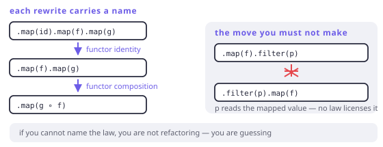

# Equational reasoning

> **In this chapter**
> - refactoring as a chain of substitutions, each justified by a named law
> - a worked transformation: five stages down to two, on paper
> - laws as property tests, with a generator and no test framework
> - the preconditions that make the whole method valid, and how they fail

## Refactoring is substitution

Chapter 2 defined referential transparency: a call can be replaced by its
result. Its bigger sibling is **equational reasoning** — replacing any
expression with an equal one, anywhere, and knowing the program is unchanged.

Every law in Part II is such an equation:

| Law | Equation |
|---|---|
| Functor composition | `m.map(f).map(g)` = `m.map(g ∘ f)` |
| Functor identity | `m.map(id)` = `m` |
| Monad left identity | `of(a).flatMap(f)` = `f(a)` |
| Monad associativity | `m.flatMap(f).flatMap(g)` = `m.flatMap((x) => f(x).flatMap(g))` |
| Monoid associativity | `(a + b) + c` = `a + (b + c)` |

Read left to right they are optimisations; right to left they are
clarifications. Both directions are legal, which is what makes them a *tool*
rather than a fact.

## A worked transformation

Start with code nobody would defend:

```dart run
import 'package:fxdart/fxdart.dart';

void main() {
  final source = [3, 8, 2, 9, 4];

  // Before: five stages, two of them pointless.
  final before = fx(source)
      .map((n) => n)
      .map((n) => n * 2)
      .map((n) => n + 1)
      .filter((n) => n > 5)
      .fold(0, (a, b) => a + b);

  // After: two stages. Same value, by four substitutions.
  final after = fx(source)
      .map((n) => n * 2 + 1)
      .filter((n) => n > 5)
      .fold(0, (a, b) => a + b);

  print([before, after, before == after]);
}
```

The four steps, each with its licence:

1. `map((n) => n)` is `map(id)` → delete it. **Functor identity.**
2. `map(f).map(g)` → `map(g ∘ f)`, giving `map((n) => n * 2 + 1)`.
   **Functor composition.**
3. Nothing moved across the `filter`, because the predicate reads the *mapped*
   value — that reordering would need a precondition we do not have.
4. The `fold` is untouched; `+` on `int` is associative with identity `0`, so
   the seed is genuinely the monoid's `empty`. **Monoid laws.**

Two things are worth noticing. First, the transformation is mechanical — no
cleverness, no testing required to believe it. Second, step 3 is where a
careless "simplification" would introduce a bug, and the law is what tells you
to stop.



*Figure 19-1. Each arrow is a rewrite with a name. If you cannot name the law, you are not refactoring — you are rewriting and hoping.*

## Laws as tests

A law is a property, and a property is a test you can run on many inputs. No
framework is required to make the point:

```dart run
import 'package:fxdart/fxdart.dart';

// A tiny generator: deterministic, so a failure is reproducible.
List<int> sample(int n, int seed) {
  final rnd = createSeededRandom(seed);
  return List.generate(n, (_) => (rnd() * 200).floor() - 100);
}

Either<String, int> half(int n) =>
    n.isEven ? Either.right(n ~/ 2) : Either.left('odd: $n');

Either<String, int> dec(int n) => Either.right(n - 1);

void main() {
  var checked = 0;
  var failures = 0;

  for (final x in sample(200, 42)) {
    final m = Either<String, int>.right(x);

    // functor identity
    if (m.map((v) => v) != m) failures++;
    // monad left identity
    if (Either<String, int>.right(x).flatMap(half) != half(x)) {
      failures++;
    }
    // monad right identity
    if (m.flatMap((v) => Either<String, int>.right(v)) != m) {
      failures++;
    }
    // associativity
    final lhs = m.flatMap(half).flatMap(dec);
    final rhs = m.flatMap((v) => half(v).flatMap(dec));
    if (lhs != rhs) failures++;

    checked += 4;
  }

  print('$checked properties checked, $failures failures');
}
```

Two hundred inputs, four laws, one line of output. In a real suite this becomes
a `package:test` file (or `package:glados` for shrinking), but the shape does
not change: **generate inputs, assert an equation, run on every commit.**

The reason to bother is not that FxDart's `Either` might be wrong. It is that
*your* types have laws too — the `Money` that must never go negative, the
`Cache` whose `get` after `put` must return what you put — and those are
exactly as testable, with far more bugs to find.

```dart run
// A property test for a type of your own.
class Money {
  const Money(this.cents);
  final int cents;

  Money operator +(Money other) => Money(cents + other.cents);
  static const zero = Money(0);

  @override
  bool operator ==(Object o) => o is Money && o.cents == cents;
  @override
  int get hashCode => cents;
}

void main() {
  final values =
      [0, 1, 99, 100, -50, 123456].map(Money.new).toList();
  var bad = 0;

  for (final a in values) {
    // identity
    if (a + Money.zero != a) bad++;
    if (Money.zero + a != a) bad++;
    for (final b in values) {
      for (final c in values) {
        // associativity
        if ((a + b) + c != a + (b + c)) bad++;
      }
    }
  }

  print('monoid violations: $bad');
}
```

## The preconditions

Equational reasoning works when equals really are equal, and there are exactly
three ways for that to fail:

1. **Impurity.** If a callback logs, mutates, or reads the clock, two
   expressions with the same value are not the same program. Chapter 2.
2. **The wrong equality.** Laws are stated *over an equality*: structural for
   `Either`, observational for `Future`, set-equality for `Set`. A law can hold
   under one and fail under another — Chapter 1's exercise made this concrete.
3. **A type that does not obey.** `Counted` in Chapter 5 and `Logged` in
   Chapter 1 both had a lawful-looking `map`/`flatMap` and broke a law. Reading
   the name is not enough; the laws are a claim someone has to have checked.

That third one is why the test in this chapter is not academic. A law you have
not tested is a comment.

> 🎓 **How far this goes.** In a total, pure language the method scales all the
> way to proof: Haskell's `foldr/build` fusion, Coq's extraction, and GHC's
> rewrite rules are all equational reasoning performed by a machine on your
> behalf. Dart is neither total nor pure, so the method stays a *human* tool
> plus tests. That is a real difference in strength, not in kind: the same
> equations, checked by sampling rather than by proof, which is the same
> relationship property tests have with proofs everywhere.

## When this earns its keep

Every time you simplify a pipeline, extract a helper, or fuse two stages for
performance — that is this chapter's method, whether or not you name the law.
Naming it is what turns "I think this is the same" into "this is the same, and
here is why".

It pays hardest in review: "which law lets you move that `filter` before the
`map`?" is a question that either has an answer or has found a bug.

It does not pay as ceremony in code that has no laws to appeal to — imperative
setup, IO sequencing, UI callbacks. There, reasoning is about state and order,
and equations have nothing to say.

## Exercises

1. Is `fx(xs).filter(p).map(f)` equal to `fx(xs).map(f).filter(p)`? State the
   precondition precisely, then give a `p` and `f` that break it.
2. Justify `xs.map(f).toList().map(g).toList()` → `xs.map((x) => g(f(x)))
   .toList()` step by step. Which step also changes the cost?
3. Extend the property test to check that `map` and `flatMap` agree:
   `m.map(f)` == `m.flatMap((x) => Either.right(f(x)))`. Which law makes this
   true for every lawful monad?
4. Your `Cache` has `put` then `get` returning the value put. Write that as an
   equation, then say what the equation implies about `put`'s return type.

## Solutions

1. Not in general. It holds only when `p` is a predicate on the *unmapped*
   value — that is, when the version after the swap tests the same thing.
   Break it with `f = (n) => n * 2` and `p = (n) => n > 5`: filtering first
   keeps 6, 7, 8…, mapping first keeps 3, 4… doubled. The two answers differ
   because `p` was written for a different type of value.
2. Delete the intermediate `toList()` (a materialisation, not a semantic step);
   apply functor composition to fuse the two `map`s; keep the final `toList()`.
   The cost changes at the first step: one intermediate list disappears, which
   is the allocation mechanism from Chapter 14 showing up in a refactor.
3. It is the definition of `map` in terms of `flatMap` plus **left identity**:
   `flatMap((x) => of(f(x)))` applied to a `Right(a)` gives `of(f(a))`, which
   is `Right(f(a))`, which is `map(f)`. Every lawful monad satisfies it, which
   is why "every monad is a functor" is a theorem rather than a convention.
4. `cache.put(k, v).get(k) == v` — and notice the equation only *type-checks*
   if `put` returns the cache. A `void put` makes the property unstateable
   without talking about mutation and order, which is the same reason immutable
   APIs are easier to test: equations need values on both sides.
