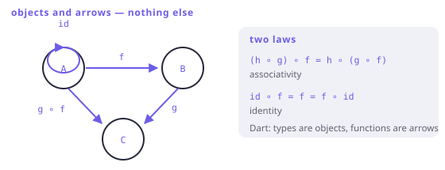

# Category theory, in the right dose

> **In this chapter**
> - what a category is, in four lines, with Dart as the example
> - functors and natural transformations, and which Dart code is which
> - the monad definition in its original form, and how it maps to `flatMap`
> - the famous sentence, decoded — and why you did not need it

This chapter is skippable. Everything it names, you have already used; nothing
in it will change how you write Dart. Read it if you want the map that connects
the parts, or to be able to read a paper without bouncing off the notation.

## A category, in four lines

A **category** is:

1. a collection of **objects**;
2. for each pair of objects, a collection of **morphisms** (arrows) between
   them;
3. a **composition** operation: given `f : A → B` and `g : B → C`, an arrow
   `g ∘ f : A → C`;
4. an **identity** arrow `id_A : A → A` for every object.

Subject to two laws: composition is associative, and identity is neutral.

That is the whole definition, and Dart is an example of it. Objects are types;
morphisms are functions; composition is what Chapter 4 wrote as `compose2`;
identities are `(x) => x`. The two category laws are the two facts Chapter 4
relied on without ceremony.



*Figure 20-1. A category is arrows that compose. Nothing about "elements" appears in the definition — which is exactly why the same theory covers types, and also sets, spaces, and orderings.*

The step that trips people is that a category *forgets what the objects are
made of*. `int` is not a set of numbers here; it is a dot with arrows leaving
it. Every theorem in the subject is therefore a statement about the *shape of
composition*, and that is why it transfers to programming at all.

## Functors, again

A **functor** `F` between categories maps objects to objects and arrows to
arrows, preserving identity and composition:

```
F(id_A)   = id_F(A)
F(g ∘ f)  = F(g) ∘ F(f)
```

Those are precisely Chapter 5's two laws. In programming we use *endo*functors:
`F` maps the category of Dart types to itself. `List` sends the object `int` to
the object `List<int>`, and sends the arrow `int → String` to the arrow
`List<int> → List<String>` — the latter is `map`.

So `map` is the arrow-half of a functor, and the reason it must not change the
structure is that a functor is *defined* as the thing that preserves it.

## Natural transformations

Given two functors `F` and `G`, a **natural transformation** `α : F ⇒ G` is a
family of arrows `α_A : F(A) → G(A)`, one per type, satisfying:

```
α_B ∘ F(f)  =  G(f) ∘ α_A
```

In Dart: a generic function that changes the *container* without touching the
contents, and commutes with `map`. You have written several:

```dart run
import 'package:fxdart/fxdart.dart';

// A natural transformation: Either<E, _> ⇒ Option-ish (_?)
A? toNullable<E, A>(Either<E, A> e) =>
    e.fold((_) => null, (a) => a);

void main() {
  int f(int n) => n * 3;

  final r = Either<String, int>.right(7);
  final l = Either<String, int>.left('nope');

  // naturality: map then transform == transform then map
  print([toNullable(r.map(f)), toNullable(r)?.let(f)]);
  print([toNullable(l.map(f)), toNullable(l)?.let(f)]);
}

extension Let<T> on T {
  R let<R>(R Function(T) f) => f(this);
}
```

Both sides agree, for both cases — that is naturality, and it is the formal
statement of "this conversion does not look at the values". `toList()`,
`toAsync()`, `first`, `sequence` and `flatten` are all natural transformations,
which is why none of them can be surprising: they cannot depend on the contents
they are moving.

## The monad, in its original clothes

A monad on a category **C** is a triple `(T, η, μ)`:

- `T` — an endofunctor;
- `η : Id ⇒ T` — a natural transformation, "unit";
- `μ : T² ⇒ T` — a natural transformation, "multiplication" or "join";

satisfying three coherence conditions:

```
μ ∘ T(μ)  = μ ∘ μ_T          (associativity)
μ ∘ T(η)  = id  =  μ ∘ η_T   (unit, both sides)
```

Translated:

| Category theory | Dart |
|---|---|
| `T` | the type constructor — `Either<E, _>`, `List`, `Future` |
| `η` (unit) | `of` / `Either.right` / `[x]` / `Future.value` |
| `μ` (join) | `flatten` — `List<List<A>> → List<A>` |
| `flatMap(f)` | `μ ∘ T(f)` — map, then flatten |
| the coherence conditions | Chapter 1's three laws |

```dart run
import 'package:fxdart/fxdart.dart';

void main() {
  // μ: T² ⇒ T. Dart spells it `flat` / `expand(id)`.
  final nested = [
    [1, 2],
    [3],
    [4, 5]
  ];
  print(fx(nested).flat().toList());

  // flatMap = μ ∘ T(f): map to a nested structure, then join.
  int f(int n) => n;
  final viaMapThenJoin =
      fx([1, 2, 3]).map((n) => [n, n * 10]).flat().toList();
  final viaFlatMap =
      fx([1, 2, 3]).flatMap((n) => [n, n * 10]).toList();
  print([viaMapThenJoin, viaFlatMap, f(1)]);
}
```

The two definitions — `flatMap` versus `map` + `join` — are interchangeable,
which is why some languages give you one and some the other, and why Chapter 1
could define the monad without mentioning `μ` at all.

## The famous sentence

> *A monad is a monoid in the category of endofunctors.*

You now have every piece:

- **Endofunctors** on Dart's types form a category: objects are functors like
  `List` and `Future`, arrows are natural transformations between them.
- That category has a way to combine two objects: **composition** of functors
  (`F` then `G`), which plays the role of multiplication.
- The identity functor plays the role of the unit.
- A **monoid** there is an object `T` with `μ : T ∘ T ⇒ T` (combine) and
  `η : Id ⇒ T` (unit), obeying associativity and identity — Chapter 8's two
  laws, one level up.

Which is exactly the definition above. The sentence is *true*, *precise*, and
useless as a first explanation — it defines the special case by pointing at the
general one, which is the right order for mathematics and the wrong one for
learning.

> 🎓 **What the theory buys, honestly.** Not code — you have written every
> construct in this book without it. What it buys is *transfer*: the same
> theorems apply to parsers, probability distributions, build systems and state
> machines, so a result proved once is available everywhere. And it buys
> vocabulary precise enough that two people can disagree productively. If you
> want to go further, the useful next objects are adjunctions (which explain
> why `flatMap` and `map` come in pairs) and free monads (which explain
> interpreters); neither is needed for anything in Part I to IV.

## When this earns its keep

Reading. Papers, Haskell libraries, Scala's Cats, and any discussion where
someone says "that is just a natural transformation" — this chapter is the
decoder ring for those.

Also naming. Once you can say "this conversion is natural", you have a precise
way to state a design rule ("it must not inspect the contents") that no amount
of prose in a doc comment achieves.

It does not earn its keep in code review, in commit messages, or in
conversation with a colleague who has not read it. The vocabulary is a tool for
thinking, and using it as a credential is how the subject got its reputation.

## Exercises

1. Show that Dart's types and functions really do satisfy the two category
   laws. What are you actually relying on about `compose2`?
2. Is `List.reversed` a natural transformation from `List` to `List`? Check
   naturality with `f = (n) => n * 2`, then say what makes it natural despite
   changing order.
3. `first` maps `List<A>` to `A?`. Is it natural? What about `sortBy`, which
   maps `List<A>` to `List<A>`?
4. Write out `flatMap` as `μ ∘ T(f)` for `Either<E, _>`. What is `μ` for
   `Either`, concretely?

## Solutions

1. Associativity: `compose2(compose2(f, g), h)` and `compose2(f, compose2(g,
   h))` both call `h(g(f(x)))`. Identity: `compose2(id, f)` and `compose2(f,
   id)` both call `f(x)`. You are relying on `compose2` being *just*
   application — no logging, no memoisation, nothing extra. An impure
   `compose2` would break the category laws, which is the same observation
   Chapter 2 made about substitution.
2. Yes. `xs.map(f).reversed` and `xs.reversed.map(f)` give the same list,
   because `reversed` rearranges positions without consulting values. Natural
   does not mean "structure-preserving" in the sense of order — it means
   "independent of the contents", and a permutation qualifies.
3. `first` is natural: `xs.map(f).first` equals `f(xs.first)` when non-empty,
   and both are absent when empty. `sortBy` is *not* — it inspects the values to
   decide the order, so `xs.map(f).sortBy(k)` and `xs.sortBy(k).map(f)` differ
   in general. That is the clearest one-line test for naturality: does it look
   at the contents?
4. `μ : Either<E, Either<E, A>> → Either<E, A>` collapses the two layers —
   `Left(e)` stays `Left(e)`, `Right(Left(e))` becomes `Left(e)`,
   `Right(Right(a))` becomes `Right(a)`. Then `flatMap(f)` is `map(f)` followed
   by that collapse, which is exactly what the implementation does when it
   pattern-matches on both levels.
