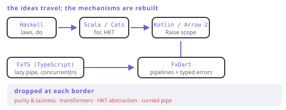

# Lineage

> **In this chapter**
> - where each idea in this book was invented, and what problem it solved there
> - the four translations, and the specific thing each one lost
> - why FxDart's API looks the way it does — FxTS's names, Arrow's errors
> - what to take from each ancestor when you read their documentation

## Five languages, one set of ideas

| | Introduced / popularised | Lost in translation |
|---|---|---|
| **Haskell** (1990) | typeclasses, monads as an interface, `do` | nothing — it is the source; the cost is the language itself |
| **Scala** (2004) | monads in an OO language, `for`-comprehensions, Cats | implicit resolution complexity; two syntaxes for everything |
| **Kotlin + Arrow** (2017) | typed errors without HKTs, `Raise`, context receivers | generic abstraction over effects — deleted in Arrow 2 |
| **FxTS** (2021) | lazy pipelines, `concurrent(n)`, in TypeScript | laws as a stated contract; TS types are erased at runtime |
| **FxDart** (2025) | the FxTS model + Arrow's errors, in Dart | curried `pipe`, and every HKT abstraction |

Read the right-hand column as a single sentence: **each translation kept the
shape and dropped whatever its host language could not carry.**



*Figure 21-1. The ideas travel; the mechanisms do not. Every arrow is a port that preserved the vocabulary and re-implemented the machinery with whatever the new language had.*

## Haskell: where the interface came from

Monads were introduced to Haskell to solve a specific problem — how a
*pure* language can do IO — and the answer was to make effects into values
with a common interface. That interface is a typeclass, which is why every
chapter of Part II is shaped like one: a type constructor, a couple of
operations, and laws that instances must satisfy.

What Haskell contributed that survives everywhere: **the laws are the
contract.** A `Monad` instance that breaks associativity is a bug, not a
variant. Every library in this lineage inherits that standard even when it
cannot enforce it.

What does not translate: laziness by default, purity enforced by the compiler,
and typeclass resolution. Reading Haskell for ideas is worthwhile; copying its
signatures into Dart is not.

## Scala: monads meet objects

Scala showed that the vocabulary works in a language with subtyping and
methods — `flatMap` as a method rather than a free function, `for` as
desugaring, and (in Cats) the whole typeclass tower re-created with implicits
and higher-kinded types.

It also demonstrated the failure mode that made later designers cautious:
`EitherT[Future, E, A]` and friends. Monad transformers are the general answer
to "monads do not compose", and in practice they produce code with a lift at
every level and error messages that are impossible for a newcomer. Chapter 7's
depth box records why Arrow and FxDart both refused this route.

## Kotlin's Arrow: typed errors without the tower

Arrow 1.x tried to be Cats for Kotlin, including the `Kind` encoding Chapter 10
demonstrated. Arrow 2.x deleted almost all of it and rebuilt around one idea:
**a scope with a non-local exit.**

```
either { val x = parse(raw).bind(); ... }      // Kotlin, Arrow 2
either((r) { final x = r.bind(parse(raw)); ... })  // Dart, FxDart
```

That is the direct ancestor of Chapter 15, and the reason FxDart's typed-error
API uses Arrow's vocabulary — `Raise`, `bind`, `ensure`, `accumulate`,
`NonEmptyList`, `zipOrAccumulate` — rather than inventing new names. When
Arrow's documentation explains a subtlety about accumulation, it applies here
too.

Kotlin has one thing Dart does not: context receivers, which let `bind()` be an
extension available implicitly inside the scope. Dart needs the explicit `r.`
prefix. That is a real ergonomic loss and the reason FxDart's scopes are
"scope-first by design": you type `r.` and the editor lists the vocabulary.

## FxTS: the pipeline half

Everything in Parts I and III comes from the other parent. FxTS brought:

- lazy pipelines built from small operators, sync and async under one
  vocabulary;
- `concurrent(n)` and its back-channel — Chapter 13's mechanism, invented there;
- the naming that FxDart follows almost exactly, so an FxTS user can read
  FxDart code.

What could not be ported is Chapter 4's subject: FxTS's curried `pipe` needs
variadic generics, which TypeScript fakes with overloads and Dart cannot fake
at all. FxDart's typed chain is the replacement, and `WHY_CURRIED.md` is the
written record of that decision — worth reading as an example of documenting a
port's deviations rather than pretending they do not exist.

## FxDart: what it is, exactly

```dart run
import 'package:fxdart/fxdart.dart';

Either<String, int> parse(String s) {
  final n = int.tryParse(s);
  return n == null ? Either.left('bad: $s') : Either.right(n);
}

void main() async {
  // FxTS ancestry: lazy chain, bounded concurrency.
  final ports = await fx(['8080', '9000', '7000'])
      .toAsync()
      .mapConcurrent(2, (s) async => s)
      .toList();

  // Arrow ancestry: typed failures, scope, accumulation.
  final parsed = fx(ports).map(parse).flattenOrAccumulate();

  print(parsed);
  print(fx(['1', 'x']).map(parse).flattenOrAccumulate());
}
```

Two ancestries, one library, and the seam between them is deliberate: the
pipeline half never mentions `Either`, and the error half never mentions
laziness. They meet only at the traversals of Chapter 9.

> 🎓 **Ideas older than all of them.** Monads entered computing through Eugenio
> Moggi's 1989 work on categorical semantics of programs, and Philip Wadler's
> papers turned them into a programming technique. `NonEmptyList`, applicative
> validation and the "railway" picture come from the same period's ML and
> Haskell practice. Delimited continuations — Chapter 15's mechanism — are
> older still, from 1980s Scheme. Almost nothing in this book was invented in
> the last decade; what changed is that mainstream languages grew enough type
> system to host the ideas, which is why the same set arrived in Kotlin,
> TypeScript, Swift and Dart within a few years of each other.

## Reading the ancestors

- **Haskell** — read for the *laws* and for what an interface looks like when
  the compiler checks it. Ignore the syntax debates.
- **Scala/Cats** — read for the *tower*: applicative, traverse, monoid, and
  their relationships stated generically. Ignore the transformer stack unless
  you enjoy it.
- **Arrow (Kotlin)** — read the typed-error and accumulation docs directly;
  they are the closest thing FxDart has to a specification for Part IV.
- **FxTS (TypeScript)** — read for the operator catalogue and the concurrency
  model; FxDart's names match, and the examples usually translate line for
  line.

## When this earns its keep

When you are stuck. Nearly every question you can ask about this vocabulary has
been answered at length in one of the four ancestor communities, and knowing
which one to search is most of the work.

It also earns its keep as inoculation: seeing that each language paid a
different price for the same ideas makes it obvious that the ideas are not the
property of any one syntax — and that a Dart port refusing a Haskell feature is
usually a design decision, not a shortfall.

## Exercises

1. Arrow 2 deleted its `Kind` encoding and its `Validated` type. What did each
   deletion cost, and what did it buy?
2. FxTS's `pipe` takes a value and a list of curried operators; FxDart's chain
   is methods. Name one thing FxTS can express that FxDart cannot, and one
   thing FxDart gets that FxTS does not.
3. Scala solves `Future` + `Either` with `EitherT`; FxDart solves it with
   `eitherAsync`. Which one generalises to a third effect, and what does the
   other one do instead?
4. Which chapters of this book would need to be rewritten if Dart gained
   higher-kinded types tomorrow? Which would not change at all?

## Solutions

1. Deleting `Kind` cost generic abstraction over effects — no single
   `traverse`, no shared combinators — and bought readable types and error
   messages, plus an API a newcomer can use without learning the encoding.
   Deleting `Validated` cost a dedicated accumulating type and bought one
   result type in every signature; the accumulation behaviour moved into a
   scope, which is strictly more explicit at the call site.
2. FxTS can hold `map(f)` as a value and pass it around — operators are
   first-class, so you can build a pipeline dynamically from a list of stages.
   FxDart gets full static types through the whole chain, including inference
   into the callbacks, which FxTS's `pipe` only achieves through a wall of
   hand-written overloads.
3. `EitherT` generalises: it is one wrapper per monad, so a third effect is
   another transformer in the stack (at the cost of lifts everywhere).
   `eitherAsync` does not generalise — FxDart writes each useful combination by
   hand, and there are only a few, because the combinations people actually use
   are few.
4. Chapter 10 would be rewritten (it is *about* the absence), and Chapter 9's
   "four spellings" section would collapse to one. Chapters 1, 5, 6, 7, 8 and
   19 would not change at all — the definitions and laws are language-neutral,
   which is the whole reason the theory was worth learning separately from the
   library.
