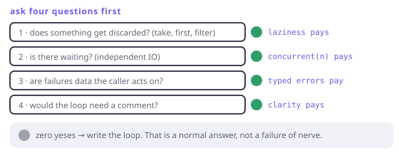

# When not to use any of this

> **In this chapter**
> - five shapes where the imperative version is simply better
> - the cost nobody puts in the README: reading, debugging, hiring
> - a checklist you can apply before writing the pipeline
> - what to keep even when you throw the rest away

## The honest position

Everything in this book is a tool with a price. Twenty-one chapters have argued
for the tools; this one prices them, because a technique you cannot argue
*against* is a belief, not an engineering choice.

## Five shapes where the loop wins

**1. Hot, uniform, fully consumed.** Chapter 14's losing shape: many cheap
stages, every element used, in a path that runs constantly. The per-element
indirection is pure overhead and there is no refused work to earn it back.

```dart run
void main() {
  final xs = List.generate(8, (i) => i);

  // Sometimes this is just the right code.
  var sum = 0;
  for (final x in xs) {
    if (x.isOdd) sum += x * x;
  }
  print(sum);
}
```

**2. Index arithmetic.** Sliding comparisons with irregular strides,
in-place transforms, algorithms defined on positions (binary search, two
pointers, dynamic programming tables). The pipeline vocabulary describes
*sequences of values*; when your algorithm is about *positions in a buffer*,
translating it costs clarity and buys nothing.

**3. One step.** A single `map` over a five-element list is
`list.map(f).toList()`. Wrapping it in `fx(...)` adds a name to learn and a
type to explain, for zero benefit. The same goes for one fallible call:
`int.tryParse` returning `null` is complete; making it an `Either<String, int>`
means inventing an error message nobody reads.

**4. Genuinely imperative work.** Building a buffer, driving a state machine,
writing bytes to a socket, orchestrating a migration script. These are
sequences of *effects*, and Chapter 2's advice — push effects to the edges —
means the edges exist and should look like what they are.

**5. Push-shaped problems.** Chapter 12's rule. UI events, sockets, timers, and
anything where several consumers must see the same event: use `Stream` (or the
`fxEvents` layer) and stop trying to pull.

## The costs nobody lists

**Reading cost is real and unevenly distributed.** A ten-stage chain is denser
than the loop it replaced. Dense is good when the reader knows the vocabulary
and bad when they do not, and *your team* is the variable that decides which.

**Debugging is worse.** A stack trace inside a lazy pipeline shows iterator
frames, not your stage names. A breakpoint in a callback fires interleaved with
other stages (Chapter 5's fusion, working as designed). Print debugging needs
`peek`. None of this is fatal; all of it is slower than stepping through a
loop.

**The abstraction can outgrow the problem.** The failure mode is not one clever
chain — it is a codebase where a reader must hold four typeclass names in their
head to follow a three-line function. If naming the abstraction takes longer
than the code it saves, it lost.

**Team cost compounds.** Every construct here is a thing to teach. That is fine
for `map`/`filter`/`fold`, which any Dart developer knows; it is a real
investment for `accumulate`, `traverse` and the `Raise` scope. Spend it where
it pays and not everywhere.



*Figure 22-1. Four questions, asked before writing the pipeline. Three "no"s and a loop is the right answer — which is a normal outcome, not a failure of nerve.*

## The checklist

Before reaching for the pipeline vocabulary:

1. **Does something get discarded?** `take`, `first`, a selective `filter`, an
   early exit. If yes, laziness is earning its keep (Chapter 11).
2. **Is there waiting?** Independent IO that could overlap. If yes,
   `concurrent(n)` is worth the chain on its own (Chapter 13).
3. **Are failures data?** Multiple fallible steps whose reasons the caller
   needs. If yes, typed errors pay (Chapters 15–18).
4. **Would the loop need a comment?** Nested grouping, three accumulators,
   a "seen" set — if the imperative version needs a paragraph, the pipeline is
   usually shorter *and* clearer.

Three or four yeses: use the tools. One yes: use the tools for that part only.
Zero: write the loop, and do not apologise.

## What to keep regardless

Even if you never use FxDart again, four things from this book survive:

- **Purity as a design tool** (Chapter 2). Pure core, effectful shell, and
  knowing which is which.
- **Illegal states unrepresentable** (Chapter 3). This is free — it is Dart's
  own `sealed` and records, and it prevents more bugs than everything else here
  combined.
- **The failure-channel rule** (Chapter 18). Throw for bugs, `A?` for absence,
  a typed value for anything the caller acts on.
- **Laws as a prediction and review tool** (Chapters 5 and 19). "Which law lets
  you move that?" is a good question in any codebase, in any style.

Those four are style-independent. The rest is a toolkit, and toolkits are
chosen per job.

> 🎓 **The strongest version of the counter-argument.** It is not "FP is slow"
> (Chapter 14 measured: usually a tie) and not "it is hard" (the vocabulary is
> a dozen words). It is *locality*: an imperative loop puts everything a reader
> needs in eight consecutive lines, while a pipeline distributes behaviour
> across callbacks, laws and library semantics the reader must already know.
> Abstraction trades local clarity for global structure. When a codebase has
> little global structure to gain — a script, a one-off, a small tool — the
> trade is simply bad, and no amount of elegance changes the arithmetic.

## When this chapter earns its keep

Every time you are about to write a pipeline because it feels sophisticated
rather than because it is shorter or safer. The checklist takes ten seconds and
is the cheapest code review you will ever run.

## Exercises

1. Take a pipeline from your own code and apply the checklist. How many yeses?
   If fewer than two, rewrite it as a loop and compare the diff.
2. Write the worst reasonable pipeline for "sum the even numbers in a list",
   then the loop. Which is shorter? Which would you rather debug at 2am?
3. Chapter 14 found the pipeline faster in three of 53 cases. What did those
   three have in common, and does your hot path have it?
4. Name a piece of code in your project where typed errors would be *worse*
   than an exception, and say precisely why.

## Solutions

1. Most existing pipelines score two or three, which is why they were written.
   The ones that score zero are usually a `map` over a small fixed list that
   could be a `for` — and rewriting them is a small, real improvement, not a
   defeat.
2. The loop is shorter and easier to debug: `for (final x in xs) if (x.isEven)
   sum += x;` versus a chain plus a fold with a seed. Debugging at 2am favours
   the version where every value is visible in a local variable — which is a
   genuine argument, not a concession.
3. All three refused work: they used `take`/`first` after a stage whose native
   equivalent did the whole job (a full sort, a full scan). If your hot path
   consumes everything it produces, that mechanism is unavailable to you and
   the ratio will not favour the pipeline.
4. Anything the caller cannot act on: a failed assertion about an internal
   invariant, a corrupted cache file at startup, a programming mistake in an
   argument. Modelling those as `Either` forces every caller to handle a case
   whose only sensible handling is to give up — and it hides the stack trace
   that would have located the bug.
